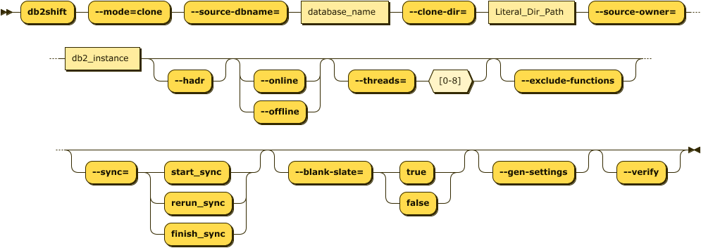
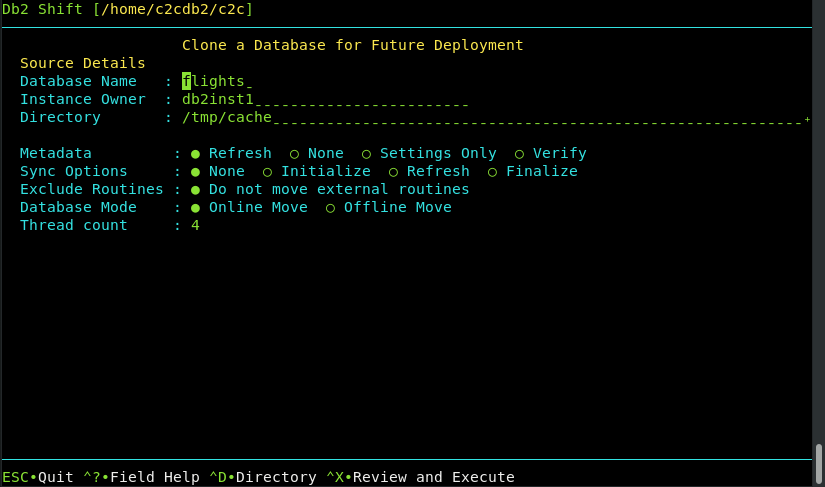

# Clone a Database

The Db2 Shift clone option is used to take an existing Db2 database that is currently
on-premise, and clone it into a directory. This cloned database can then
be transported to another server and be deployed at that location.

The advantage of cloning is that the destination does not need to be 
connected to the source location and the deployment of the clone can
be done at a more convenient time.

The Db2 Shift program requires the following information:

* Source Database details
* Clone Options

The destination details are not required to clone a database.

The syntax for creating a cloned database is:

<pre><code class="language-bash">db2shift

    Required Options

    --mode=clone   
    --source-dbname=flights
    --source-owner=db2inst1
    --clone-dir=/tmp/cache
 
    Optional Settings

    --online or --offline
    --threads=4
    --exclude-functions
    --sync=[start_sync, rerun_sync, finish_sync]
    --blank-slate=[true|false] --gen-settings
    --verify
</code></pre>

The panel that provides this capability:

 
## Mode Option (Command Line Only)

Syntax: `--mode=clone`

The MODE option determines what steps the Db2 Shift program will take to 
move your database to the new location. 

The CLONE option can be used to create 
a copy of database to be moved to another location and then deployed. This feature is useful 
in situations where the target system cannot be reached through the network due to 
firewall issues.

## Settings

* [Database Name (Source)](reference.md#source-database)
* [Instance Owner](reference.md#source-or-instance-owner)
* [Clone Directory](reference.md#clone-directory)
* [Metadata](reference.md#metadata-generation)
* [Synchronization Options](reference.md#synchronization-options)
* [Exclude Routines](reference.md#stored-procedures-and-functions)
* [Database Mode](reference.md#online-or-offline-move)
* [Thread Count](reference.md#threading)