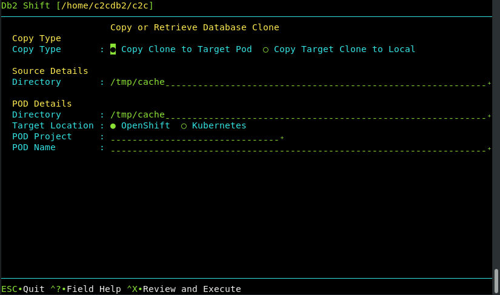

# Clone Copy

This Db2 Shift command provides a feature that allows a user to copy an existing
database clone copy to a POD, or to retrieve a database clone from a POD. 

Once a database clone has been generated, the copy can be moved to any location and then 
deployed locally. This option provides a convenient way of copying the database using 
Db2 Shift without having to use OpenShift or Kubernetes commands.

The panel requires the following information:

* Type of copy (From Source to Target or Target to Source)
* Source cloned database directory
* Target cloned database directory
* The destination POD and server details

The syntax for copying a cloned database to a POD:

<pre><code class="language-bash">db2shift

    Required Options         

    --mode=push_clone (Source to Target)
    --mode=pull_clone (Target to Source)
    --dest-type=POD
    --oc or --kubectl
    --dest-server=c-demo-db2u-0
    --local-dir=/tmp/cache
    --dest-dir=/tmp/cache

    Optional Settings

    --dest-namespace=db2u
</code></pre> 

The panel that provides this capability:

 
## Mode Option (Command Line Only)

Syntax: `--mode=push_clone`, `--mode=pull_clone`

The Db2 Shift will copy a cloned database to a pod, or
retrieve the contents of a cloned database back to the local
instance.

## Destination Type (Command Line Only)

Syntax `--dest-type=POD`

The destination is a POD. This setting is only required when using the command line. It
is automatically generated by the UI. 

## Settings (Command Line and UI)

* [Source Clone Directory](reference.md#source-clone-directory)
* [Target Clone Directory](reference.md#target-clone-directory)
* [Target Client (Instance to Pod)](reference.md#target-client-instance-to-pod)
* [Destination Server (Pod)](reference.md#destination-server-pod)
* [Destination Pod Namespace or Project](reference.md#destination-pod-namespace-or-project)
