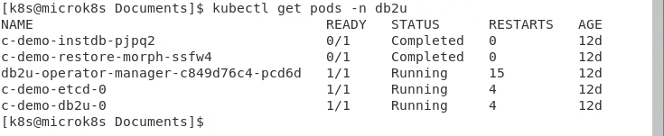
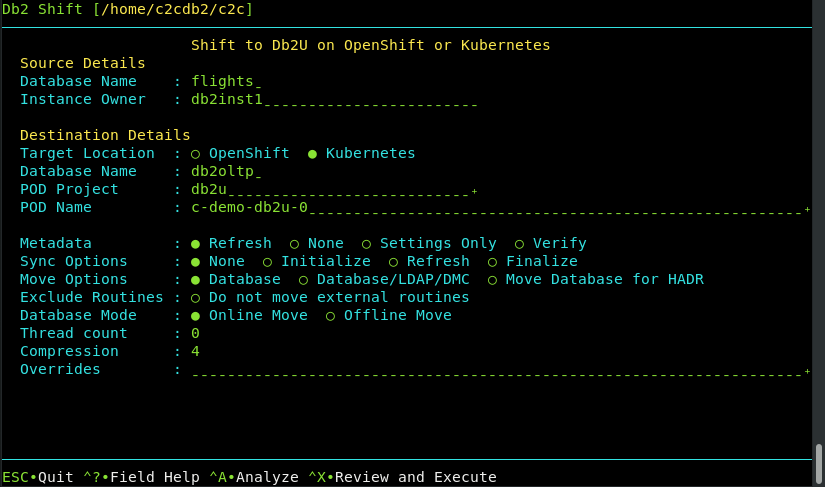

# Cluster Authentication

When shifting a database to a containerized environment (OpenShift, Kubernetes, Cloud Pak for Data),
the connection to the cluster must be established before running any Shift except for Cloning.

The ways to authenticate to a cluster are listed below, based on standard scenarios. Your 
installation may require different setup steps than those listed below.

## Cluster Command Line Interface

In order to authenticate and execute commands against a cluster, you must have a copy 
of the cluster CLI available on your source machine. For an OpenShift or Cloud Pak for Data
environment, download a copy of the `OC` command line interface from:

* [Red Hat Customer Portal](https://access.redhat.com/)
* [OpenShift Github](https://github.com/openshift/oc)
* [OpenShift Community Distribution](https://docs.okd.io/latest/cli_reference/openshift_cli/getting-started-cli.html)
 
For Kubernetes distributions, you can download the code from:

* [Kubernetes Tools](https://kubernetes.io/docs/tasks/tools/) 

You can also issue the following command from a Linux terminal window to download
the code:

```
curl -LO "https://dl.k8s.io/release/$(curl -L -s https://dl.k8s.io/release/stable.txt)/bin/linux/amd64/kubectl"
```
 
Once the code has been downloaded, place the code into the
local bin directory and make sure that it has been marked as
executable.
```
chmod +x kubectl
mkdir -p ~/.local/bin
mv ./kubectl ~/.local/bin/kubectl
```

## Authenticating to OpenShift

Before running the Db2 Shift command, you need to connect to the OpenShift cluster. If you
are running Cloud Pak for Data, you must authenticate to the OpenShift cluster, not the
CP4D services.

To connect to an OpenShift cluster, you can use one of two methods:

* Userid and Password
* Access token

The syntax of the connection command is:
```
oc login [server] --username=userid --password=pw --insecure-skip-tls-verify=true
```

The server field contains the IP address and PORT number to communicate with OpenShift:
```
https://10.1.1.1:8443
```
The port number could be `6443`, `8443` or `16443` depending on the way the 
cluster was created.

The TLS flag is used when working with internal clusters
that have self-assigned certificates. 

**Note:** The userid and
password must be for an administrative user that has access
to the Db2u project and the Db2 pods

If you are using a token for connecting to the cluster:
```
oc login [server] --token=averylongtokenidentifier --insecure-skip-tls-verify=true
```

To generate a login token, you must be logged into the load balancer for the OpenShift
cluster. The token is generally created for you by the cluster administrator. However,
if you have access to the cluster servers, you can generate a token using the following
method. 

Assume the load balancer for the cluster is `10.1.1.1`.

* Use secure shell connection to connect to the host

    `ssh root@10.1.1.1`
    
    You will require the root/sysadmin password on the host as well as the 
    OpenShift administrative userid and password.
  
* Log in as the administrative user

    `oc login -u adminID -p adminPassword`
  
* View the Configuration and extract the Token

    `oc config view --minify | grep token`
    
    `token: LKtPjTxnwuvoX1aJw_xGpcca4wz6Cj5VsWFgzokmy30`
   
* The token is used in place of a userid/password when connecting

    `oc login https://10.1.1.1:8443 -t LKtPjTxnwuvoX1aJw_xGpcca4wz6Cj5VsWFgzokmy30`
    
**Note:** Make sure that the token expiration is sufficient to cover the amount of 
time required to shift the database. The Db2 Shift command issues commands to the 
cluster at various stages of the shift process. Several hours could be spent moving
data between the source and target and if the token expires during the period, the
shift will fail because of authentication issues.    

## Authenticating to Kubernetes

The [Kubernetes documentation](https://kubernetes.io/docs/tasks/access-application-cluster/access-cluster-services/)
provides examples of how to connect to a cluster. An administrator would grant access
to a namespace and resources to a user.

If you have access to the cluster, you can generate the appropriate configuration
file using the following steps:

* Extract the Kubernetes configuration information from the cluster

    `kubectl config > config`
    
    The config file that is generated contains all the
    information required to connect to the Kubernetes cluster that
    is running on this server.
    
* Copy the config file to the source database server
  
    `mkdir ~/.kube`
    
    `cp ~/Downloads/config ~/.kube/config`

* Check the `kubectl` command can connect 

    The kubectl command will search the hidden directory
    (`~./kube`) for a file named config. If this file is found it
    will then use it for authenticating against the Kubernetes
    cluster.

## Projects and Namespaces

The Db2 Shift command operates against Db2U pods that are running in a project or 
namespace. Openshift refers to projects, and Kubernetes refers to namespaces.

Before attempting to run any Db2 Shift command, you must first authenticate to the 
cluster and then connect to the proper project or namespace.

Use the following syntax to change to the Db2 project.

* OpenShift 

    ```
    oc project db2u
    ```
    
* Kubernetes

    ```
    kubectl config set-context --current --namespace=db2u 
    ```

You can also specify which project or namespace to use when using the Db2 Shift command:

```
--project=db2u --namespace=db2u
```

If you do not supply a namespace or project in the Db2 Shift command, it will
issue cluster commands assuming it is in the correct project. You will end up with
errors being generated during execution
since resources (pods) will not be found in the current namespace.

## PODS and Projects

In order to refer to a Db2 POD, three pieces of information are required:

* Project - Which project or namespace was the Db2U POD created under
* Name - High-level name of the PODS in a deployment
* POD Name - The Db2U POD name

The output from a `kubectl get pods -n db2u` command is shown below.



The YAML used to create the Db2U deployment provides information on how the Db2U
POD name was generated.

```
apiVersion: db2u.databases.ibm.com/v1
kind: Db2uCluster
metadata:
  name: demo 
  namespace: db2u
spec:
  account:
    privileged: true
  environment:
    dbType: db2oltp
    instance:
      password: db2oltp
    ldap:
      enabled: false
    database:
      name: DB2OLTP
```

The `metadata:name` is a unique qualifier for all of the PODS that make up the Db2u 
deployment. This name must be unique for every Db2U that is created.

The `metadata:namespace` is the namespace of project that Db2U will be deployed into.
You can have many Db2U PODS created in the same namespace.

Finally, the name of the database field `database: name` is `DB2OLTP` and this will be required when
entering the details of the target database being replaced.

A sample Db2 Shift dialog (Shift from Instance to POD) illustrates the fields that
need to be filled in.



The fields that are required from a destination perspective are:

* Target Location - OpenShift or Kubernetes
* Database Name - `db2oltp` (`database:name`)
* POD Project - `db2u` (`metadata:namespace`)
* POD Name - `c-demo-db2u-0`

The POD name can be retrieved from the `kubectl` command above or derived as:

`c-` `metadata:name` `-db2u-0` or `c-demo-db2u-0`

Once you have these details available, you will be able to fill in the fields on the
Db2 Shift dialog and begin the shift process.
