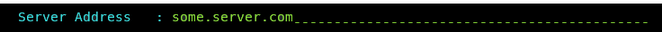

# Clone Deployment to another Db2 Instance

This Db2 Shift option will take a database clone and deploy it into another 
Db2 instance running natively (in any environment including Cloud VMs).

The panel requires the following information:

* Database name and clone location
* Destination instance details
* Shift Options

The syntax for deploying a clone to another Db2 INSTANCE is:

<pre><code class="language-bash">db2shift

    Required Options

    --mode=apply_clone    
    --dest-type=OTHER
    --ssh or --local
    --source-dbname=flights
    --source-owner=db2inst1
    --clone-dir=/tmp/cache
    --dest-dbname=db2oltp
    --dest-owner=db2inst1                                            
    --dest-server=db2inst1@some.server.com

    Optional Settings

    --hadr
    --online or --offline
    --threads=4
    --compress-level=4
    --exclude-functions
    --sync=[start_sync, rerun_sync, finish_sync]
    --blank-slate=[true|false] --gen-settings
    --verify
</code></pre>

The panel that provides this capability:

## Mode Option

Syntax: `--mode=apply_clone`

The MODE option determines what steps the Db2 Shift program will take to 
move your database to the new location. 

The APPLY_CLONE option will take an existing CLONEd database and shift
it to a POD or a Db2 instance. There is no need to be connected to
the original database because all of the control information is 
contained within the CLONEs image.
 
## Target Client (Instance to Instance)

Syntax: `--ssh`, `--local`

The client for a deploy (clone) operation must be supplied as part of the Db2 Shift command. 
Only one of the following targets must be used:

* `--ssh` Remote Db2 Instance
* `--local` Local Db2 Instance

If the target is a remote Db2 instance (`--ssh`), Db2 Shift expects that a passwordless
ssh environment has been established between the source and target servers.

The `--local` option only applies to Clones (database copies) that are being deployed
onto the same server that the Db2 Shift command is running on. The ability to
shift a database locally (i.e. make a copy of a Db2 database on the same instance)
is currently disabled due to some restrictions with `db2relocatdb`. 

## Source Database

Syntax: `--source-database=""`

The source database is the name of the database that you have in the cloned
copy. The deploy option double checks that you have the proper database
in the clone.

Note that you can have the same or different database
name at the target. If you provide a different database name at the target,
the program will copy the clone and place it on the
target and use the existing name.

## Source or Instance Owner

Syntax: `--source-owner="instance name"`

The Db2 Shift checks that the cloned copy was created with the 
instance owner provided with this setting. 

## Clone Directory

Syntax: `--clone-dir=""`

The cloned copy of the database will be retrieved from the directory that is
specified by this field. 

## Destination Database

Syntax: `--dest-database=""`

The destination database name can be the same as the source database, or 
a completely different name. Make sure that if you are creating a database
with a different name that it doesn't currently exist on your target system.
Otherwise, the target database will be deleted!

## Destination Server (Instance)

Syntax: `--dest-server=userid@ip.address`

For destinations that are traditional Db2 instances, you must provide the 
userid and the IP address or symbolic name of the destination server. You only use an IP address
for shifting into a traditional Db2 instance.

The format of the parameter is `userid`@`address` when using the Db2 Shift command line. 

When connecting to a remote instance, the Db2 Shift program 
expects that a passwordless ssh environment has been established between the 
source and target servers. The `--ssh` flag must be used in conjunction with this
parameter.

## Stored Procedures and Functions

Syntax: `--exclude-functions`

By default, the Db2 Shift command will automatically move all external stored procedures and functions 
that are found in the `$HOME/sqllib/function` path to the new destination. All SQLPL and PL/SQL routines 
are moved as part of the database move, so there is no migration required for those routines. 

Use the exclude flag to prevent any external functions being moved to the destination.

## HADR Setup

Syntax: `--hadr"`

When HADR mode is selected, the database will be copied over to the target location and initialized as an HADR secondary. 
The database can now be connected with the primary database as an HADR pair and participate in failover or readonly applications. 

This option cannot be used if your database needs to be migrated or if the database needs to be renamed.      

## Synchronization Options

Syntax:  `--sync=[start_sync, rerun_sync, finish_sync]`

The Db2 Shift program has two methods of moving the database to the
destination. The traditional method is to take one pass at the database
and move everything at once. During the finishing process, the program
will briefly suspend the database (depending on settings) and perform
a final refresh. This last step will pick up any database objects that 
may have changed over the course of the move.

The total amount of time the database is suspended is directly related
to how much information has changed during the shift process. In the 
event that you have large amount of changes, the final refresh may
too long an outage. To minimize this outage, you can use the 
synchronization options provided.

The default setting is do a complete shift operation without intermediate sync operations.

To initialize the synchronization option, the first Db2 Shift
command will use the sync option.

Syntax: `--sync=start_sync`

This initial step will instruct Db2 Shift to copy all of the 
required database objects to the target system. Once the copies are 
complete, the program will end processing and leave the target
system in an incomplete state. During this process the source
database is operational and it will **not be suspended**. 

When there is an appropriate moment, the database movement can 
be finalized with the `finish_sync` option.

Syntax: `--sync=finish_sync`

The `finish_sync` option will do one final pass against the source
database and then it will finalize the database movement on the 
destination site. During the last pass the finish process will
`suspend` the database to get a consistent database environment.
Once this step completes, the destination database will be 
available.

In the event that the source system has high update volumes, there
may be a need to do multiple sync operations to minimize the
finalize step. The Db2 Shift command will need to be told
that it is syncing the database again, but not to start from 
scratch. The control files generated by the `--sync=start_sync` option
will allow Db2 Shift to move database objects that are new
or have changed since the initial synchronization request. The 
command to do the sync and only refresh the database objects
requires the use of the `rerun_sync` option.

Syntax: `--sync=rerun_sync`

The `rerun_sync` option indicates to the Db2 Shift program to
start syncing process to look for delta changes only.

The `--sync=rerun_sync` process can be run repeatedly until
the amount of changes between runs is minimized. When an appropriate
timeslot is available, the shift can be finalized by using the
`finish_sync` option.

Syntax: `--sync=finish_sync`

The `finish_sync` option will perform the final pass against the source
database and complete the shift process as before.

In summary, the standard shift operation will complete in one step (no
`--sync` option is used). The `--sync=start_sync` option allows you 
to gradually move a database over time. For a gradual
database shift, use the `start_sync` option on the first run. This will move
an initial set of database files to the target. Then use the `rerun_sync` option
on subsequent runs to copy any files that may have been added or changed to
the database. When you are ready to finalize the shift, use the `finish_sync`
option to gather any remaining files and complete the shift operation on
the target system.

## Metadata Generation

Syntax: `--blank-slate=[true|false]`, `--gen-settings`, `--verify-only`

The Db2 Shift command generates metadata that is used during the shift process. This metadata is key to determining which
objects need to be moved from a source to destination as well as validating that the source can be successfully moved.

Generating metadata requires access to the source and destination systems. If for some reason the connection to the 
source or destination is unavailable, the existing metadata files can still be used. In most cases you will not need to 
adjust these settings unless you have encountered a shift error.

### Blank Slate

Syntax: `--blank-slate=true`

The `--blank-slate` option determines whether or not the existing metadata is refreshed. The default is value 
for `--blank-slate` is `true` which will display in the GUI as `Refresh`. The `--blank-slate` option will 
delete any existing metadata files and recreate them on your system during the shift operation. The
default option is `true` which will result in new source and destination settings being generated.

If you are importing settings files from other systems, or if you need to rerun the shift process without regenerating the files,
use the `--blank-slate=false` option. When Db2 Shift executes it will use the existing metadata in the working directory and 
attempt to use those settings. 

Syntax: `--blank-slate=false`

One scenario that involves the use of `--blank-slate=false` occurs when a shift operation fails at the target OC/Kubernetes pod
because of a communication error. The database at the destination will be left in an inconsistent state and must be rebuilt
by the shift process. The settings for the destination database can no longer be retrieved because the database cannot be 
started. Because of this reason, you must use the existing destination settings that were generated when you first ran the
Db2 Shift command.

### Generate Settings

Syntax: `--blank-slate=true`, `--gen-settings`

The `--gen-settings` (Generate Settings) option is used in conjunction with `--blank-slate`. The use of `--gen-settings` 
will prevent Db2 Shift from continuing execution after the metadata files have been created. 

### Verification

Syntax: `--verify-only`

The `--verify-only` option will generate the metadata files and check the connectivity and all settings and then stop
execution. If `--verify-only` completes successfully, the Db2 Shift command will be able to execute the shift process.

## Online or Offline Move

Syntax: `--online`, `--offline`

By default, the Db2 Shift command will suspend the database while it completes the last scan of the files. During this
period of time, the database will not complete any insert, update, or delete transactions. This will result in a consistent
database at the destination, but some transactions will not have been committed to the database. If the database
at the destination must be identical to the source database, then you must choose the `--offline` option which
will shut down the database so there will not be any transactions outstanding when the shift is completed. 

Note: The period of time that the database is suspended or stopped is dependent on the changes that have occurred in the
database from the time the shift operation started to the time when copying of the data is complete. The 
changes that have occurred during this period of time needs to be captured during the final step. It is during this
step that the database must be suspended or stopped. During the initial scan the database will remain completely online 
and will not be impacted by the shift utility from a transaction perspective. However, since there is a large amount of
disk reads taking place, it may impact bufferpool read performance.

The `--offline` mode must be used when shifting a database that requires a migration from an older release of 
Db2. This option must be specified when shifting Db2 versions 10.5 or 11.1.  

## Performance: Threading

Syntax: `--threads=[0..8]`

The copy phase of the Db2 Shift program is able to use multiple threads to transmit data to a destination. 
This settings allows you to increase
the parallelism up to 8 threads. As you increase the number of threads, the amount of data being transmitted
increases, at the expense of greater CPU usage and network congestion. The default value is 4 which strikes a balance between
overhead and network performance.

## Performance: Compression

Syntax: `--compression=[0..9]`

RSYNC compresses the data during the transfer process to allow for faster
movement of data. The amount of compression can be adjusted from 0 to 9
with 0 turning off compression and values between 1 and 9 increasing the
amount of compression applied to the data. Higher compression values will
result in more CPU usage and may not significantly reduce the size of the
datastream. 

A value of 4 has been found to be a good compromise between 
compression overhead and data size. For slow networks, 
a higher value may reduce transmission times at the expense of increased CPU overhead.