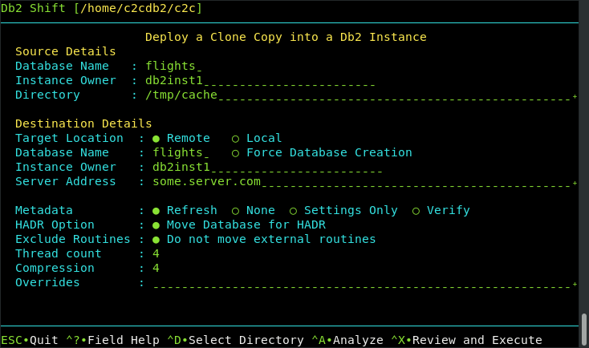

# Clone Deployment to another Db2 Instance

This Db2 Shift option will take a database clone and deploy it into another 
Db2 instance running natively (in any environment including Cloud VMs).

The panel requires the following information:

* Database name and clone location
* Destination instance details
* Shift Options

The syntax for deploying a clone to another Db2 INSTANCE is:

<pre><code class="language-bash">db2shift

    Required Options

    --mode=apply_clone    
    --dest-type=OTHER
    --ssh or --local
    --source-dbname=flights
    --source-owner=db2inst1
    --clone-dir=/tmp/cache
    --dest-dbname=db2oltp
    --dest-owner=db2inst1                                            
    --dest-server=db2inst1@some.server.com

    Optional Settings

    --hadr
    --online or --offline
    --threads=4
    --compress-level=0
    --exclude-functions
    --sync=[start_sync, rerun_sync, finish_sync]
    --blank-slate=[true|false] --gen-settings
    --verify
</code></pre>

The panel that provides this capability:

## Mode Option (Command Line Only)

Syntax: `--mode=apply_clone`

The MODE option determines what steps the Db2 Shift program will take to 
move your database to the new location. 

The APPLY_CLONE option will take an existing CLONEd database and shift
it to a POD or a Db2 instance. There is no need to be connected to
the original database because all of the control information is 
contained within the CLONEs image.

## Destination Type (Command Line Only)

Syntax `--dest-type=OTHER`

The destination is another instance (OTHER). This setting is
only required when using the command line. It is
automatically generated by the UI. 

## Settings (Command Line and UI)

* [Database Name (Source)](reference.md#source-database)
* [Instance Owner](reference.md#source-or-instance-owner)
* [Clone Directory](reference.md#clone-directory)
* [Target Location (Instance)](reference.md#target-client-instance-to-instance)
* [Database Name (Destination)](reference.md#destination-database)
* [Force Destination Database Creation](reference.md#force-destination-database-creation)
* [Destination Owner](reference.md#destination-owner)
* [Server Address](reference.md#destination-server-instance)
* [Metadata](reference.md#metadata-generation)
* [HADR Option](reference.md#hadr-setup)
* [Exclude Routines](reference.md#stored-procedures-and-functions)
* [Thread Count](reference.md#threading)
* [Compression](reference.md#compression)
* [Overrides](reference.md#overrides)