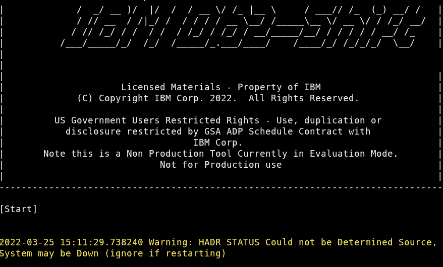
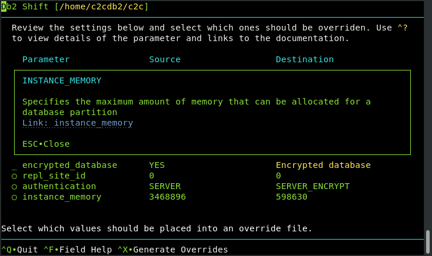

# Db2 Shift User Interface

Db2 Shift can be run either as a command line utility, or as an application with a 
menu system. The Db2 Shift menu system provides an easy-to-use interface for 
generating the appropriate shift commands, and includes extensive help on the
various parameters that need to be supplied.

This section will discuss the user-interface in detail and describe the additional features
that are only found in the UI including:

* The ability to check the source and destinations to determine whether they are compatible
* View errors logs for diagnosing problems
* Ability to save commands as separate executable shell scripts

## Enabling UI Mode

The Db2 Shift UI Mode is automatically invoked when the
`db2shift` command is issued without any parameters.
Requesting help with the `--help` flag will also display help
panels using the UI system.

If your terminal session does not support color, the UI can
be forced to the display the text as WHITE characters on a
BLACK background. Use the `--mono` flag when using the
`db2shift` command.

For terminals that do not show any color, please check the
settings in the TERM environment variable.
```
echo $TERM
```
If the results do not show xterm-256color then you will need
to check what terminal emulations are available with the
following command:
```
toe -a
```
This will produce a list of terminal emulations. The
preferred settings is xterm-256color, but other color
options may also work.

Update the terminal emulation setting by issuing the command:
```
export TERM=xterm-256color
```

To make this change permanent on your system, edit the `~/.bashrc` configuration file in your 
instance home directory and add the above command to the end of the script. Save the file and then
issue the following command to change the terminal settings.
```
source ~/.bashrc
```

If you find the display contains strange characters (white
boxes instead of underscores for fields) like those on the
following page, then your OS may not support many of the
Unicode characters.


This is an indication that Unicode character set extensions
have not been installed on the Linux distribution being
used. The `--mono` flag will change the characters so that
they are more readable in this environment. When using the
UI, the following characters will be substituted for the
graphical characters:

* Underscore (fields) with dots “...”
* Checkbox selection with asterisk “*” and unselected with dash “-“
* More (scrollbar) with “+” and previous with “-“

The following screen illustrates the difference in mono mode.


## Menu System Overview

The Db2 Shift menu system provides access to all scenarios that are described in this
documentation:

* Shift a Db2 database to OpenShift, Kubernetes or CP4D
* Shift a Db2 database to another Db2 instance
* Create a Cloned copy of the Db2 database for later deployment
* Deploy a clone into an OpenShift, Kubernetes or CP4D container
* Deploy a clone into another Db2 instance
* Initialize HADR between Source and Target POD 
* Initialize HADR between Source and Target Instance
* Initialize DMC and LDAP Authentication for CP4D
* Copy Cloned databases to a POD

The various screens are described in the sections below. Some features that are 
specific to the UI are:

* Legal Disclaimer
* Help Information
* Analyze Database Configuration
* Review shift log files

## Interacting with the UI 

The Db2 Shift UI is based on a character-based terminal display, similar to 
VT100 or 3270 technology. Using a character-based display format eliminates
the need for a graphic display environment (GDM) and significantly reduces
the memory requirements for the program.

When using a terminal-based UI, only keyboard entries can be used to navigate
the screen (instead of mouse movements). There are some panels which will
display URLs pointing to reference material. If your environment provides
access to a mouse, you will be able to click on these links. However, mouse
clicks within the UI have no effect.

The keys that are active within a screen are usually displayed at the bottom of
the screen.


The last three lines of all Db2 Shift panels will include a message line, a 
separator line, and a list of all active keys. In this example, there are five
keys:

* `ESC` - Quit
* `^F` - Field Help
* `^D` - Select Directory
* `^A` - Analyze
* `^X` - Review and Execute

The `ESCAPE` key is used to exit out of the current panel and return to the previous panel.
To completely exit out of the program at **any** time, use the `CTRL-C` combination. This 
key (break) will always stop execution of the UI and return you to the terminal prompt.

If a letter is provided as an "action" key, press that letter on the keyboard. There is no need to 
use the shift key. If the letter is proceeded with a carat symbol `^`, this represents the 
control (CTRL) key on the keyboard. In the above example, the `^F` key requires that you hit the
control key and the `F` key at the same time. 

Some screens may use letters for commands - for example, the bottom of the main screen uses letters
to switch screens:


Panels that require user input will need to use all the characters on the keyboard, so it is not
possible to use single keys to invoke an action or move to another panel. To get around this restriction,
the control key (`CTRL`) is prefixed to the character (`^A`) to tell the UI it is an action key rather than
a regular input key.

The following keys are used for navigation on a panel:

* `ESC` - Return to previous screen or close message window
* `DEL` - Delete the current character and move text left
* `Shift+DEL` - Delete field from cursor to end of field
* `BKSP` - Delete the character left of the current character
* `Up/Down` - Move up or down to the next field on the screen
* `Left/Right` - Move left/right in the field and jump to the next field. Note that long fields will scroll automatically
* `TAB` - Tab to the next input field
* `Shift+TAB` - Tab backwards to the previous input field
* `ENTER` - Select a row, execute a command, or move down to next field   
* `Home` - Cursor to the beginning of a field
* `End` - Cursor to the end of a field
* `PGUP/PGDN` - Scroll list up and down when your cursor is in the list. Note that scroll bar on the side indicates if more rows are available.
* `Shift+Up/Shift+Down` - Same as page up and page down if those keys are not available
* `SPACEBAR` - Select or deselect a list item or turn a value on or off

On a Mac (OSX), the function key needs to be used with the
Shift+Up/Down arrow to simulate a Page Up or Page Down key.

### Text Input

A text input field will contain underscores that represent the total length of the field.


Any text entered into these fields will shift characters to the left (insert mode).
Once text hits the end of the field it will no longer allow additional characters
to be entered until you delete existing characters.

If you need to remove characters from the current character position to the end of the
input field, use `Shift+DEL` to delete them.

Fields that only have one character will automatically replace the contents of the
field rather than requiring the contents to be deleted.

### Numeric Input

A numeric field will prevent the input of any characters other than valid
numbers [0-9].


### Long Fields

A number of fields require more space than what is available on the screen.
These fields are either file or directory names, or server addresses.


These long fields will allow characters to roll off the end of the field (disappear
from view). You can get to the end of the character string by using the `END` key
or back to the beginning with the `HOME` key. You can usually tell that the field 
allows for larger text sizes because there is a tiny plus sign (+) at the end of the input line
and also the text will scroll past the end of the input field as you type.

### Options

Option fields provide a way of selecting one option from a list of options.


Use the `TAB` or right arrow to move between the values in the list. Only one option can be selected at a time! 
To select an option, make sure the option circle is highlighted 
and then press the `SPACEBAR` to select the option. The previous option will be 
de-selected and the new option selected.

### Check Boxes

A Checkbox is either on or off. 


Use the `SPACEBAR` to turn an option on or off.

### Lists

There are three types of lists that are found in the UI:

* Read-only list  
* Select One from the list (similar to Options)
* Select Multiple

Read-only lists are used for documentation and when selecting an item for immediate
use (for instance, when selecting a directory). 


You can move up and down a list using the arrow keys. If the list requires a selection,
you must position the cursor on the item you want selected, and then press the 
`ENTER` key.

Selection lists are similar to Option list where a number of items are shown and
one must be selected from the list.


The example above includes two options that can be selected (circles) while the other
items only have an underscore. Only those items with circles can be selected. Use the
`SPACEBAR` to select one or more options in the list. If the list only allows one
item to be selected, it will deselect any existing item and then select the item you
were currently on.

Finally, lists may be larger than what is shown on the screen. The scrollbar
indicators will be placed at the top of the list to indicate whether there 
are values above or below the current list items that are displayed.


### Cut and Paste

If your system allows the use of a mouse, you are able to copy text from the Db2 Shift UI by selecting the text, using the
right mouse button and selecting `Copy` from the menu.


You are also able to paste items into a field positioning the cursor on the field and then selecting Paste from the terminal menu bar.


The other option for pasting a value is to use the key combination `CTRL-SHIFT-V`. This will paste the contents of the clipboard into the 
current field your cursor is positioned in.


## Disclaimer

The Db2 Shift disclaimer is always displayed when starting the Db2 Shift command. 


By pressing the `ENTER` key, you are accepting the terms and conditions of the program. If you
press `ESCAPE`, the program will immediately terminate. Details of the terms and condition
are found in the [Disclaimer](disclaimer.md) section of this documentation.

If you prefer to skip the Disclaimer screen, use the `--accept` option on the Db2 Shift command line:

```
db2shift --accept
```

## Help Panels

Help screens are created using read-only lists. The help information will be displayed with scroll bar indicators on the
far lefthand side of the text:


The up and down arrow indicate that there is text prior to
this page and that there is text after this page. Use the
Page Up and Page Down buttons (or (fn+)Shift-Up arrow and
(fn+)Shift-Down arrow) to scroll through the help.

On most panels, pressing `^F` (CTRL+F) on a field will display
detailed information about that field. For instance,
pressing `^F` on the follow field:


This will result in detailed information about the field being displayed on top of the existing panel:


The help information can be dismissed by using the `ESCAPE` key. Note that arrows on the left side of the text will
indicate if you need to use the scroll keys to view additional information.

## Main Screen

The main Db2 Shift screen provides access to all of the scenarios that have been discussed
in the documentation. 


Before describing the various options on the screen, there are some extra screens that can be accessed from the 
main screen:

* `H` - Db2 Shift Help
* `K` - Keyboard Help
* `S` - Syntax Details
* `L` - Legal Disclaimer

The Db2 Shift Help provides a general overview of the Db2 Shift program and details on every Db2 Shift scenario. The 
keyboard help provides a quick guide on how they keys work and the Syntax details provides information on every setting
that Db2 Shift uses.

The Legal disclaimer provides the entire text of the legal documentation shipped with the Db2 Shift program. Odds are
it is larger than all of the code that was written for Db2 Shift!

To exit the Db2 Shift program, press `ESCAPE` from this screen. To select one of the options, use the up and down
arrow keys to place the cursor on the option you want and then press the `ENTER` key. This will display the menu for 
that option.

The options themselves are divided into four sections:

* Shift - Shift a database from a local instance to a destination
* Clone - Clone a database and the deploy or copy to a destination
* HADR - Set up and start HADR between a source and target destination
* View - Options to analyze a local data or view current log file

Details of each one of these panels can be found in the links below.

* [Shift a Db2 database to OpenShift, Kubernetes or CP4D](guishifttopod.md)
* [Shift a Db2 database to another Db2 instance](guishifttoinstance.md)
* [Create a Cloned copy of the Db2 database for later deployment](guiclone.md)
* [Deploy a clone into an OpenShift, Kubernetes or CP4D container](guideploytopod.md)
* [Deploy a clone into another Db2 instance](guideploytoinstance.md)
* [Initialize HADR between Source and Target POD](guihadrpod.md)
* [Initialize HADR between Source and Target Instance](guihadrinstance.md)
* [Initialize DMC and LDAP Authentication for CP4D](guildapdmc.md)
* [Copy Cloned Databases to a POD](guiclonecopy.md)

Note that not every command line option will be display in
the UI panel. For instance, the mode option to move a
database to a pod is automatically generated by the UI so
there is no requirement for this setting to be supplied.

In addition to using the menu system to navigate to the
shift scenario you want to perform, you have the option of
using the following keywords to go directly to a specific
shift menu:

* --topod – Shift a Db2 database to a Kubernetes, OpenShift or CP4D pod
* --todb2 – Shift a Db2 database to another Db2 instance
* --clone – Clone a Db2 database
* --deploypod – Deploy a clone to a Kubernetes, OpenShift, or CP4D pod
* --deploydb2 – Deploy a clone to another Db2 instance
* --hadrpod – Set up connection between source and destination pod
* --hadrdb2 – Set up connection between source and Db2 instance
* --logs – View logs from last execution

## Executing Commands

Each one of the UI panels has an option to Review and Execute a command. The
key that is assigned to execute command is `^X`.


When the execute button is pressed, the Db2 Shift program will first determine if 
all of the parameters have been properly filled in. In the event of a problem,
an error message will be display and the cursor placed on the field that needs
to be updated.


When the panel passes all checks, the Db2 Shift command is displayed on another screen.

### Summary Screen


If you have mouse control on your system, you will be able to select the text on this screen and copy it into a script or 
a terminal session. Alternatively, you can use the `^S` Save Command to save the command to a file for future
execution.


If you press the Execute `^X` key on the review page, Db2 Shift will execute your command
immediately. The output from the Db2 Shift process will be displayed on the screen (the UI
will disappear).

### Db2 Shift Execution



Various messages will be displayed during the execution of the Db2 Shift command with progress bars 
indicating the current step in the process. When the execution completes, the UI will be displayed
with a success indicator and the contents of the log file.


Here is an example of a run that fails due to a connection to the Kubernetes cluster is unavailable.


The log file is displayed below the run status. You can scroll through this list to determine what steps failed during the 
Db2 Shift execution. 

A successful run will also display the log file.


The log records are truncated so that you only see 80 characters of the log file. If you want to
see more details, the `^W` (Wrap Text) will reformat the output so you will be able to see all of the
contents of the line.


## Database Analysis

Shifting a database from an instance to a POD requires the Db2 Shift program to check
that the source database meets certain criteria including:

* The source database must be 10.5, 11.1, or 11.5
* Only databases created with automatic storage are supported
* The system contains external procedures which are not in the standard Db2 library - these will need to be manually recreated and catalogued
* The LOGARCHMETH1/2 setting only supports DISK as a target in Db2u
* The database encryption keys will be moved to the new location, but if the target already has encrypted databases then you will need to manually migrate the encryption key to the target location

This checking is done when the Db2 Shift program begins execution. Even though the database may meet these requirements, the
source database environment may have certain settings which need to be present at the target location. By default, **all** database
settings are moved to the target location. However, none of the instance settings are moved during the shift step unless you
explicitly name them.

In order to test the compatibility of your source database to the target location, the Analyze `^A` key can be used:


The Analyze option is found in four of the Db2 Shift Scenarios:

* Shift to Pod
* Shift to Instance
* Deploy to Pod 
* Deploy to Instance

Note that you cannot run an Analysis step against a database
that does not currently exist on the target. This applies
only to shift or clone operations that are being performed
against a standard Db2 instance and you are requesting that
the target database be created by the Db2 Shift command.

When the Analyze function is selected, the Db2 Shift program
will gather information from the source and target databases
and present a report containing the settings that are
different between the environments:


This examples shows many of the errors that can be reported by the Analysis step. Those items in red will
stop a shift from occurring, while those in yellow are features which might cause an issue when the 
database is started in the target location. Details of the setting are available by pressing `^F` while
the cursor is on the line of the configuration parameter:


Some fields will have additional help available through a web link:



If you have access to a mouse, you will be able to click on the link in the field help display and 
have a web page display with more details on the parameter.

### Overriding Parameters

The items that have circles beside them are values which can be overridden during the shift process. For instance,
one of the settings that should change is the instance memory value. The source system currently shows 3.5M pages
of memory being allocated, while the target system only provides 600K pages of memory. The database at the target
system will end up being memory constrained and may suffer performance degradation because of the lack of memory.

To update the target value with the source value, the cursor must be placed on the setting line and the 
`SPACEBAR` pressed to select the item. 

Once you have selected the settings to override, the `^X` key is used to take all selected items in the list 
and place then into the overrides settings of the Shift or Deploy panel.


## Local Analysis

You have the option of checking whether or not a local database is suitable for a shift operation. This option is available
at the bottom of the main menu:


When you select the Analyze Local Database option, the following screen will be displayed:


Enter the name of a local database into this field and hit `Enter`. The program will analyze the database compared
to an empty Db2u container. Note that this analysis is done against a sample installation so many
of the settings that are flagged may not be applicable to a real deployment. The analysis will
highlight any incompatibilities in the source database, so any warnings or errors that are reported will need
to be investigated.