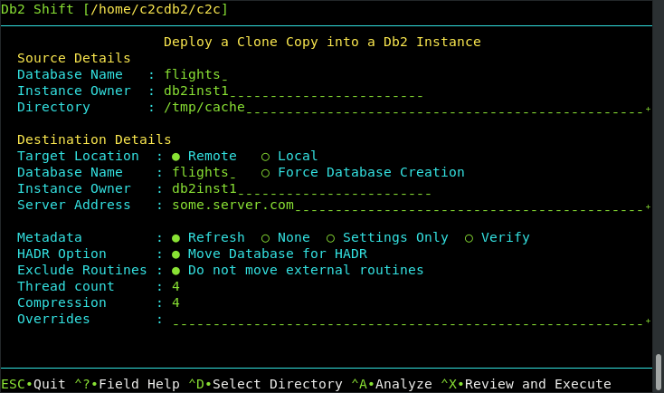

# UI - Clone Deployment to Another Db2 Instance

This Db2 Shift option will take a database clone and deploy it into another 
Db2 instance running natively (in any environment including Cloud VMs).

The panel requires the following information:

* Database name and clone location
* Destination instance details
* Shift Options

## Source Database

The source database is the name of the database that you want to move to
the new location. Note that you can have the same or different database
name at the target. If you provide a different database name at the target,
the program will copy the database from the source and place it on the
target and use the existing name.

## Source or Instance Owner

The Db2 Shift program makes the assumption that the current userid you are logged into
is the owner of the instance. This is necessary due to the requirement
to access the underlying files that are used by Db2. If you supply the 
source owner value, Db2 Shift will double check that you are working in the correct
instance and the settings files are consistent.

## Clone Directory

The cloned copy of the database will be retrieved from the directory that is
specified by this field. When the database is cloned, the contents 
of the directory can be moved to a new location and the Apply Clone UI 
option used to shift the contents of the clone into the Db2 database.

## Target Location (Instance to Instance)

The client for a deploy (clone) operation must be supplied as part of the Db2 Shift command. 
Only one of the following targets must be used:

* Remote Db2 Instance
* Local Db2 Instance

If the target is a remote Db2 instance, Db2 Shift expects that a passwordless
ssh environment has been established between the source and target servers.

The local option only applies to Clones (database copies) that are being deployed
onto the same server that the Db2 Shift command is running on. The ability to
shift a database locally (i.e. make a copy of a Db2 database on the same instance)
is currently disabled due to some restrictions with `db2relocatdb`. 

## Destination Database

The destination database name can be the same as the source database, or 
a completely different name. Make sure that if you are creating a database
with a different name that it doesn't currently exist on your target system.
Otherwise, the target database will be deleted!

## Destination Owner

The destination owner value is used for generating the connection address
and also used when settings up HADR between a primary and secondary
instance. 

## Destination Server (Instance)

For destinations that are traditional Db2 instances, you must provide the 
userid and the IP address or symbolic name of the destination server. You only use an IP address
for shifting into a traditional Db2 instance.

When connecting to a remote instance, the Db2 Shift program 
expects that a passwordless ssh environment has been established between the 
source and target servers. 

## Metadata Generation

The Db2 Shift command generates metadata that is used during the shift process. This metadata is key to determining which
objects need to be moved from a source to destination as well as validating that the source can be successfully moved.

Generating metadata requires access to the source and destination systems. If for some reason the connection to the 
source or destination is unavailable, the existing metadata files can still be used. In most cases you will not need to 
adjust these settings unless you have encountered a shift error.

### Refresh

The `Refresh` option determines whether or not the existing metadata is refreshed. The default is value 
for the Meta Data field is `Refresh`. The `Refresh` option will 
delete any existing metadata files and recreate them on your system during the shift operation. 

If you are importing settings files from other systems, or if you need to rerun the shift process without regenerating the files, use the `None` option. When Db2 Shift executes it will use the existing metadata in the working directory and 
attempt to use those settings. 

One scenario that involves the use of `None` occurs when a shift operation fails at the target OC/Kubernetes pod
because of a communication error. The database at the destination will be left in an inconsistent state and must be rebuilt
by the shift process. The settings for the destination database can no longer be retrieved because the database cannot be 
started. Because of this reason, you must use the existing destination settings that were generated when you first ran the
Db2 Shift command.

### Generate Settings

The `Settings Only` option will generate the meta files but will prevent Db2 Shift from continuing execution after the metadata files have been created. 

### Verification

The `Verify` option will generate the metadata files and check the connectivity and all settings and then stop
execution. If `Verify` completes successfully, the Db2 Shift command will be able to execute the shift process.

## HADR Setup

When HADR option is selected, the database will be copied over to the target location and initialized 
as an HADR secondary. The database can now be connected with the primary database as an HADR pair 
and participate in failover or readonly applications. 

This option cannot be used if your database needs to be migrated or if the database needs to be renamed. 

## Stored Procedures and Functions

By default, the Db2 Shift command will automatically move all external stored procedures and functions 
that are found in the `$HOME/sqllib/function` path to the new destination. All SQLPL and PL/SQL routines 
are moved as part of the database move, so there is no migration required for those routines. 

## Performance: Threading

The copy phase of the Db2 Shift program is able to use multiple threads to transmit data to a destination. 
This settings allows you to increase
the parallelism up to 8 threads. As you increase the number of threads, the amount of data being transmitted
increases, at the expense of greater CPU usage and network congestion. The default value is 4 which strikes a balance between
overhead and network performance.

## Performance: Compression

RSYNC compresses the data during the transfer process to allow for faster
movement of data. The amount of compression can be adjusted from 0 to 9
with 0 turning off compression and values between 1 and 9 increasing the
amount of compression applied to the data. Higher compression values will
result in more CPU usage and may not significantly reduce the size of the
datastream. 

A value of 4 has been found to be a good compromise between 
compression overhead and data size. For slow networks, 
a higher value may reduce transmission times at the expense of increased CPU overhead.