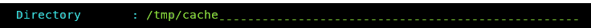

# UI - Clone Deployment to OpenShift, Kubernetes, or CP4D


This Db2 Shift option will take a database clone and deploy it into a Db2u pod running on 
OpenShift, Kubernetes or CP4D.

The panel requires the following information:

* Database name and clone location
* Destination POD details
* Type of Containerization environment
* Shift Options

## Source Database


The source database is the name of the database that you want to move to
the new location. Note that you can have the same or different database
name at the target. If you provide a different database name at the target,
the program will copy the database from the source and place it on the
target and use the existing name.

**Alert!**
</br>
If you are shifting a database to Cloud Pak for Data, and your INSTANCE userid is **not** db2inst1, you 
must execute the following SQL commands from a userid that has SECADM authority:

```
GRANT SECADM ON DATABASE TO db2inst1
GRANT DBADM  ON DATABASE TO db2inst1 
```
The `db2inst1` userid does not need to exist in the Operating system in order to grant these privileges to the userid. This
requirement does not apply to other Db2 Shift environments. If `db2inst1` is not defined as a `SECADM` and `DBADM` user in the
database, the Data Management Console feature of CP4D will not be able to access the database nor will it be able to monitor it.

## Source or Instance Owner


The Db2 Shift program makes the assumption that the current userid you are logged into
is the owner of the instance. This is necessary due to the requirement
to access the underlying files that are used by Db2. If you supply the 
source owner value, Db2 Shift will double check that you are working in the correct
instance and the settings files are consistent.

## Clone Directory



The cloned copy of the database will be retrieved from the directory that is
specified by this field. When the database is cloned, the contents 
of the directory can be moved to a new location and the Apply Clone UI 
option used to shift the contents of the clone into the Db2 database.

## Target Client (Instance to POD)


The pod client for a deploy (clone) operation must be 
supplied as part of the Db2 Shift command. Only one of the following 
clients must be used:

* OpenShift Destination
* Kubernetes Destination
* Copy of the cloned database is inside the pod

If the client is Kubernetes or OpenShift, 
the program requires that the appropriate `kubectl` or `oc` client 
has been installed locally and that the namespace or project has already been specified.

The `Local` option is used when the cloned copy of the database is already been 
copied inside the POD that it is being shifted to. 

## Destination Database


The destination database name can be the same as the source database, or 
a completely different name. Make sure that if you are creating a database
with a different name that it doesn't currently exist on your target system.
Otherwise, the target database will be deleted!

## Destination Pod Namespace or Project


In Kubernetes deployments, the location of a pod is associated with 
a namespace, while in OpenShift deployments, the pod is associated with
a project.

When authenticating to a Kubernetes or OpenShift environment, it is 
recommended that the local client be connected to the project or 
namespace that the Db2U pod is running in. 

If you do not supply a namespace or project value, the Db2 Shift program
will assume that you are already connected to that project. If this is not
the case, the program will stop with an error when it attempts to find the 
pod. 

To have Db2 Shift connect to the appropriate project or namespace, 
supply the value of the namespace or project using this option.

## Destination Server (POD)


For deployments to OpenShift, Kubernetes, or CP4D, you must supply the name
of the POD that Db2U is running in. The OpenShift or Kubernetes client should
be used to connect to the target namespace or project before issuing the 
Db2 Shift command.      


## Metadata Generation


The Db2 Shift command generates metadata that is used during the shift process. This metadata is key to determining which
objects need to be moved from a source to destination as well as validating that the source can be successfully moved.

Generating metadata requires access to the source and destination systems. If for some reason the connection to the 
source or destination is unavailable, the existing metadata files can still be used. In most cases you will not need to 
adjust these settings unless you have encountered a shift error.

### Refresh


The `Refresh` option determines whether or not the existing metadata is refreshed. The default is value 
for the Meta Data field is `Refresh`. The `Refresh` option will 
delete any existing metadata files and recreate them on your system during the shift operation. 

If you are importing settings files from other systems, or if you need to rerun the shift process without regenerating the files, use the `None` option. When Db2 Shift executes it will use the existing metadata in the working directory and 
attempt to use those settings. 


One scenario that involves the use of `None` occurs when a shift operation fails at the target OC/Kubernetes pod
because of a communication error. The database at the destination will be left in an inconsistent state and must be rebuilt
by the shift process. The settings for the destination database can no longer be retrieved because the database cannot be 
started. Because of this reason, you must use the existing destination settings that were generated when you first ran the
Db2 Shift command.

### Generate Settings


The `Settings Only` option will generate the meta files but will prevent Db2 Shift from continuing execution after the metadata files have been created. 

### Verification


The `Verify` option will generate the metadata files and check the connectivity and all settings and then stop
execution. If `Verify` completes successfully, the Db2 Shift command will be able to execute the shift process.
 
## HADR Setup


When HADR mode is selected, the database will be copied over to the target location and initialized as an HADR secondary. 
The database can now be
connected with the primary database as an HADR pair and participate in failover or readonly applications. 

This option cannot be used if your database needs to be migrated or if the database needs to be renamed.    

## Stored Procedures and Functions


By default, the Db2 Shift command will automatically move all external stored procedures and functions 
that are found in the `$HOME/sqllib/function` path to the new destination. All SQLPL and PL/SQL routines 
are moved as part of the database move, so there is no migration required for those routines. 

Select this option to prevent any external functions being moved to the destination.

## Performance: Threading


The copy phase of the Db2 Shift program is able to use multiple threads to transmit data to a destination. 
This settings allows you to increase
the parallelism up to 8 threads. As you increase the number of threads, the amount of data being transmitted
increases, at the expense of greater CPU usage and network congestion. The default value is 4 which strikes a balance between
overhead and network performance.

## Performance: Compression


RSYNC compresses the data during the transfer process to allow for faster
movement of data. The amount of compression can be adjusted from 0 to 9
with 0 turning off compression and values between 1 and 9 increasing the
amount of compression applied to the data. Higher compression values will
result in more CPU usage and may not significantly reduce the size of the
datastream. 

A value of 4 has been found to be a good compromise between 
compression overhead and data size. For slow networks, 
a higher value may reduce transmission times at the expense of increased CPU overhead.

