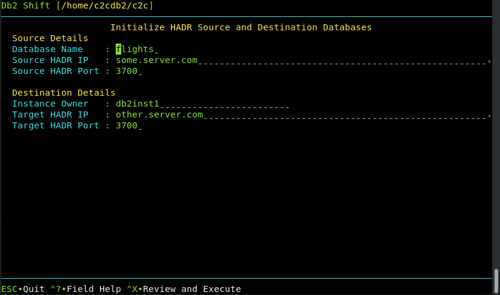

# UI - Initialize HADR between Source and Target Instance

This menu is similar to the previous one where the HADR service is setup between the source
Db2 database and another Db2 instance. The Db2 database on the target system must have been
created with one of the following settings during the shift step.

The panel requires the following information:

* The source database name and server
* The destination server details

The syntax for initiating the HADR connection between two Db2 servers is:

## Source Database

The source database is the name of the database that you want to set up for
HADR at the source and target location. Note that you must have the same database
name at the target. If you provide a different database name at the target,
the program will generate an error.

## HADR Source Server

For HADR setup, the Db2 Shift command requires the IP or symbolic
name of the source server that will be used in an HADR setup. This 
server is referred to as the primary server. 

## HADR port

HADR communicates over a port which is different than the Db2
instance. You must supply the source and destination port numbers
that Db2 will communicate between the HADR servers. The default
port number is 3700 for HADR communications, but verify the value. The target
port number will also be required.

## Destination Server (Instance)

For destinations that are traditional Db2 instances, you must provide the 
userid and the IP address or symbolic name of the destination server. You only use an IP address
for shifting into a traditional Db2 instance.

The format of the parameter is `userid`@`address` when using the Db2 Shift command line. When using the 
UI, this field is generated automatically by combining the destination instance owner name with the
destination server address.

When connecting to a remote instance, the Db2 Shift program 
expects that a passwordless ssh environment has been established between the 
source and target servers. The `--ssh` flag must be used in conjunction with this
parameter.