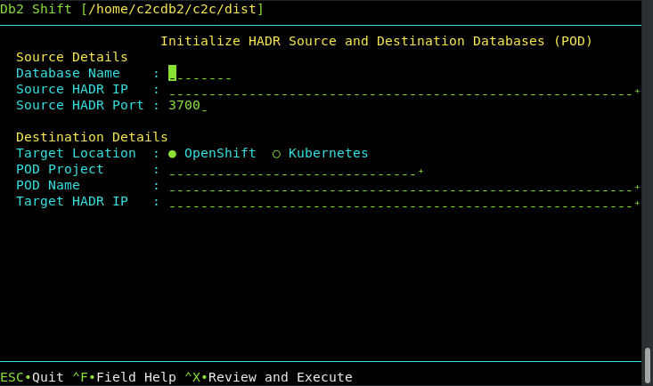

# UI - Initialize HADR between Source and Target POD

This Db2 Shift option will take a source and destination (POD)
database and start the HADR service between them. The Db2u pod must have been created 
with the following setting during the shift step.

The panel requires the following information:

* The source database name and server
* The destination POD and server details

## Source Database

The source database is the name of the database that you want to set up for
HADR at the source and target location. Note that you must have the same database
name at the target. If you provide a different database name at the target,
the program will generate an error.

## HADR Source Server

For HADR setup, the Db2 Shift command requires the IP or symbolic
name of the source server that will be used in an HADR setup. This 
server is referred to as the primary server. 

## HADR port

HADR communicates over a port which is different than the Db2
instance. You must supply the source and destination port numbers
that Db2 will communicate between the HADR servers. The default
port number is 3700 for HADR communications, but verify the value. The target
port number will also be required.

## Target Client (POD)

Syntax: `--oc`, `--kubectl`

The pod client for setting up HADR is required. Only one of the following 
clients must be used:

* `--oc` OpenShift Destination
* `--kubectl` Kubernetes Destination

If the client is Kubernetes (`--kubectl`) or OpenShift (`--oc`), 
the program requires that the appropriate `kubectl` or `oc` client 
has been installed locally and that the namespace or project has already been specified.

## Destination Pod Namespace or Project

Syntax: `--dest-namespace=""`, `--dest-project=""`

In Kubernetes deployments, the location of a pod is associated with 
a namespace, while in OpenShift deployments, the pod is associated with
a project.

When authenticating to a Kubernetes or OpenShift environment, it is 
recommended that the local client be connected to the project or 
namespace that the Db2U pod is running in. 

If you do not supply a namespace or project value, the Db2 Shift program
will assume that you are already connected to that project. If this is not
the case, the program will stop with an error when it attempts to find the 
pod. 

To have Db2 Shift connect to the appropriate project or namespace, 
supply the value of the namespace or project using this option.

## Destination Server (POD)

Syntax: `--dest-server="pod_name"`

For deployments to OpenShift, Kubernetes, or CP4D, you must supply the name
of the POD that Db2U is running in. The OpenShift or Kubernetes client should
be used to connect to the target namespace or project before issuing the 
Db2 Shift command. 

## HADR Destination Server

For HADR setup, the Db2 Shift command requires the IP or symbolic
name of the source server that will be used in an HADR setup. This 
server is referred to as the secondary server. For an 
OpenShift or Kubernetes cluster, use the address of the load balancer.