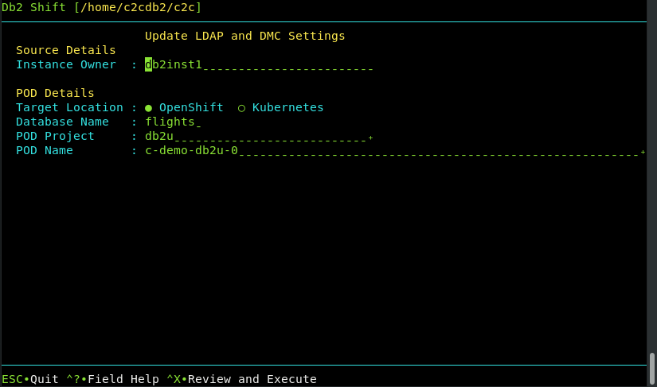

# UI - LDAP and DMC Initialization



This Db2 Shift option only applies when the destination is a POD on K8s or
OpenShift. If an associated LDAP repository exists, the db2inst1 user
is added. If the IBM Data management console is deployed with a 
Cloud Pak for Data system, it resets the console and applies the 
relevant DDL and privileges for monitors.

**Alert!**
</br>
If you creating a database on Cloud Pak for Data, 
and your source INSTANCE userid is **not** db2inst1, you 
must execute the following SQL commands from a userid that has SECADM authority:

```
GRANT SECADM ON DATABASE TO db2inst1
GRANT DBADM  ON DATABASE TO db2inst1 
```
The `db2inst1` userid does not need to exist in the Operating system in order to grant these privileges to the userid. This
requirement does not apply to other Db2 Shift environments. If `db2inst1` is not defined as a `SECADM` and `DBADM` user in the
database, the Data Management Console feature of CP4D will not be able to access the database nor will it be able to monitor it.

The panel requires the following information:

* Source database owner
* The destination POD and server details

## Source or Instance Owner


The Db2 Shift program will double check that the instance owner matches that of the 
target system when applying the LDAP and DMC settings.

## Target Client 


The pod client for the security and monitoring update operation must be 
supplied as part of the Db2 Shift command. Only one of the following 
clients must be used:

* `--oc` OpenShift Destination
* `--kubectl` Kubernetes Destination

If the client is Kubernetes (`--kubectl`) or OpenShift (`--oc`), 
the program requires that the appropriate `kubectl` or `oc` client 
has been installed locally and that the namespace or project has already been specified.

## Destination Database


The destination database must be supplied so that the updates to the security settings
and Data Management Console control tables can be properly inserted.

## Destination Pod Namespace or Project


In Kubernetes deployments, the location of a pod is associated with 
a namespace, while in OpenShift deployments, the pod is associated with
a project.

When authenticating to a Kubernetes or OpenShift environment, it is 
recommended that the local client be connected to the project or 
namespace that the Db2U pod is running in. 

If you do not supply a namespace or project value, the Db2 Shift program
will assume that you are already connected to that project. If this is not
the case, the program will stop with an error when it attempts to find the 
pod. 

To have Db2 Shift connect to the appropriate project or namespace, 
supply the value of the namespace or project using this option.

## Destination Server (POD)


For deployments to OpenShift, Kubernetes, or CP4D, you must supply the name
of the POD that Db2U is running in. The OpenShift or Kubernetes client should
be used to connect to the target namespace or project before issuing the 
Db2 Shift command. 