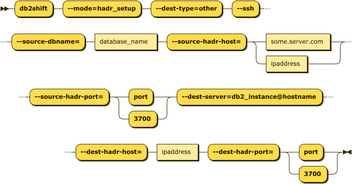
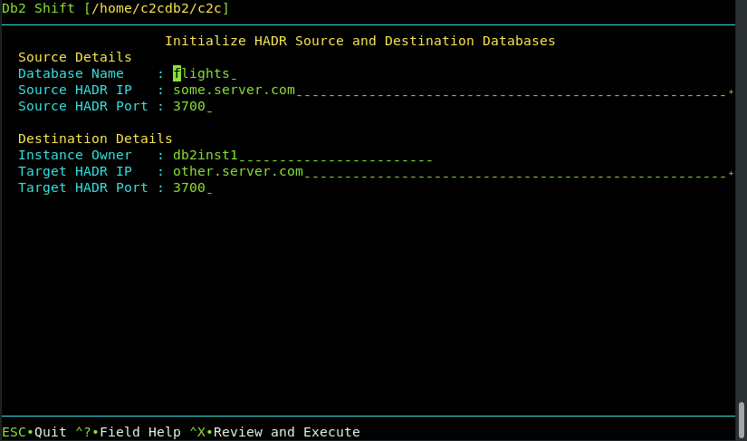

## Initialize HADR between Source and Target Instance

This menu is similar to the previous one where the HADR service is setup between the source
Db2 database and another Db2 instance. The Db2 database on the target system must have been
created with one of the following settings during the shift step.

Syntax: `--hadr`

The panel requires the following information:

* The source database name and server
* The destination server details

The syntax for initiating the HADR connection between two Db2 servers is:

<pre><code class="language-bash">db2shift

    Required Options     

    --mode=hadr_setup  
    --dest-type=OTHER
    --ssh
    --source-dbname=flights
    --source-hadr-host=some.server.com
    --source-hadr-port=3700  
    --dest-server=db2inst1@other.server.com
    --dest-hadr-host=oc.server.com
    --dest-hadr-port=3700
</code></pre> 

The panel that provides this capability:

## Mode Option (Command Line Only)

Syntax: `--mode=hadr_setup`

The HADR option is used to initialize and start HADR between a source and target server. This step
would be run after the database has been shifted to the new location. This option is 
not used for the initial HADR setup of the target system. The target database must be
created with the `--hadr` option in order for it be placed into the correct mode for
HADR communication. The `--hadr` is enabled for pods with the HADR option in the menu.

 
## Target Client (Command Line Only)

Syntax: `--ssh`

The HADR connection between instances must use `--ssh`. Db2 Shift expects that a passwordless
ssh environment has been established between the source and target servers.

## Settings (Command Line and UI)

* [Database Name](reference.md#source-database)
* [Source HADR IP](reference.md#hadr-source-or-destination-server)
* [Source HADR Port](reference.md#hadr-ports)
* [Destination Owner](reference.md#destination-owner)
* [Target HADR IP](reference.md#hadr-source-or-destination-server)
* [Target HADR Port](reference.md#hadr-ports)