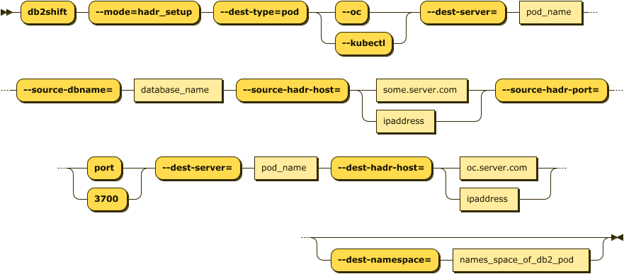

# Initialize HADR between Source and Target POD

This Db2 Shift option will take a source and destination (POD)
database and start the HADR service between them. The Db2u pod must have been created 
with the following setting during the shift step.

Syntax: `--hadr`

The panel requires the following information:

* The source database name and server
* The destination POD and server details

The syntax for initiating the HADR connection between two Db2 servers is:

<pre><code class="language-bash">db2shift

    Required Options     

    --mode=hadr_setup  
    --dest-type=POD
    --oc or --kubectl
    --source-dbname=flights
    --source-hadr-host=some.server.com
    --source-hadr-port=3700  
    --dest-server=c-demo-db2u-0
    --dest-hadr-host=oc.server.com

    Optional Settings
    
    --dest-namespace=db2u
</code></pre> 

The panel that provides this capability:

## Mode Option (Command Line Only)

Syntax: `--mode=hadr_setup`

The HADR option is used to initialize and start HADR between a source and target server. This step
would be run after the database has been shifted to the new location. This option is 
not used for the initial HADR setup of the target system. The target database must be
created with the `--hadr` option in order for it be placed into the correct mode for
HADR communication. The `--hadr` is enabled for pods with the Move Database for HADR
option in the menu.

## Destination Type (Command Line Only)

Syntax `--dest-type=POD`

The destination is a POD. This setting is only required when using the command line. It
is automatically generated by the UI. 

## Settings (Command Line and UI)

* [Database Name](reference.md#source-database)
* [Source HADR IP](reference.md#hadr-source-or-destination-server)
* [Source HADR Port](reference.md#hadr-ports)
* [Target Location](reference.md#target-client-instance-to-pod)
* [POD Project](reference.md#destination-pod-namespace-or-project)
* [POD Name](reference.md#destination-server-pod)
* [Target HADR IP](reference.md#hadr-source-or-destination-server)