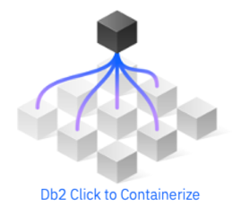

# Introduction 

The Click to Containerize family encompasses a number of tools that provide customers with the
ability to quickly modernize their Db2 landscape. The Db2 Shift utility is part of the Click to Containerize
family and can be used to clone a copy of Db2 into an OpenShift, 
Kubernetes, Cloud Pak for Data (CP4D), or a standard Db2 instance. 

The utility is intended to help customers clone their
existing Db2 databases into a containerized environment with
the minimum amount of effort. Some benefits of Db2 Click to
Containerize are:

* Automated, fast, and secure cloning of Linux databases to Hybrid Cloud
* Massively reduces time to containerize database workloads
* Enables alignment with Agile Delivery and Project Lifecycle with additional cloning capabilities once in cloud

Features of Db2 Click to Containerize include:

* The ability to clone a database without the need to unload, export, de-crypt, or backup the database
* Automatic upgrades from Db2 Version 10.5 to the latest version (11.5.7) of Db2
* Cloning of all database settings and objects, including external functions located in the Db2 library path
* Row, Columnar, and Encrypted databases can be cloned
* OLTP, SMP, and MPP databases can be cloned (excluding pureScale installations at this time)
* Easy setup of HADR servers for staged migration 

The Db2 Click to Containerize utility allows a customer to
clone their current databases to one of four platforms:

* OpenShift cluster
* Kubernetes cluster
* Cloud Pak for Data
* Another Db2 instance on premise, on Cloud, or in a Virtual Environment

In addition to directly cloning the database from one location to another, 
the Db2 Click to Containerize utility can clone a database for future deployment. 
This feature is useful for environments where the target server is air-gapped, 
or unavailable for direct connection from the source server.

Finally, the utility has two modes of operation. For expert
users, the clone command can be issued with the appropriate
options and run directly from a command line or a script.
For those users who require more help, the program can also
be run in an interactive mode, with detailed instructions
and help for the various cloning scenarios.

In summary, Db2 Shift provides the ability to quickly, and
easily, clone your Db2 Linux database into a containerized
environment with a minimal amount of time and effort.