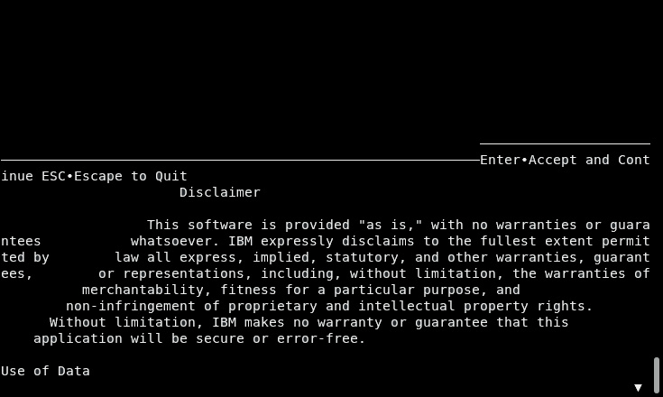

# Db2 Shift Installation

## Installation

The Db2 Shift program (`db2shift`) is a single executable
image that can be run directly on Linux. This is a bundled
application which means that it contains files and settings
that are part of the executable code. From a user
perspective, no additional software is required to run it.

The program does not create any directories on your system,
but it will generate files during the execution of a shift.
A best practice would be to create a new directory only for
the purposes of the running the Db2 Shift code.

The Db2 Shift program is bundled into a single tar file
which contains version of the code for different Linux
distributions (there may be more than those listed). Unpacking
the tar file will create a directory structure that contains the following:

* License information
* Documentation
* A directory for each distribution of Linux that is supported

	* RHEL-6 - CentOS 6, Red Hat 6
	* RHEL-7 - CentOS 7, Red Hat 7
	* RHEL-8 - CentOS 8, Red Hat 8, CentOS Stream
	* Ubuntu-18 - Ubuntu 18.04
	* Ubuntu-20 - Ubuntu 20.04
	* Ubuntu-22 - Ubuntu 22.04 
	* SUSE-15 - openSUSE 15, SUSE 15
	* PowerLE - Power Linux LE 

Each directory will contain the `db2shift` program suitable for that 
Linux distribution.

Place the program into its own directory and make sure that it has the execution bit set.

```
chmod +x ./db2shift
```
Additional versions may be added depending on feedback from users. 

The program will work in command mode for all environments.
If you attempt to use the UI mode with the incorrect OS
version, the screen may look distorted.



If your display looks like this, then you will have the
wrong version installed. If you are running on a different
platform than those listed above, please contact support.
See Appendix B for details.

## Program Download

The program is currently in Technical Preview and is available from the following download site:

* [Db2 Click to Containerize Technical Preview](https://ibm.biz/c2cdownload)

You will need an IBM userid to register and gain access to the program.
 


