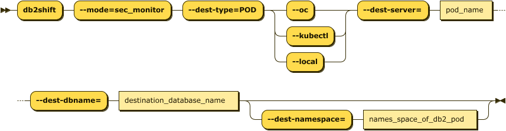

# LDAP and DMC Initialization

This Db2 Shift option only applies when the destination is a POD on K8s or
OpenShift. 

When shifting a database to a CP4D platform or LDAP-secured
environment, the Db2 Shift program will automatically add
the appropriate userids to the LDAP service and reset the
Data Management Console (DMC) so that it recognizes the
database.

If you choose to shift a database to CP4D, and set it up as
an HADR secondary, the LDAP and DMC setup cannot be
performed until **after** you have converted the secondary
POD into the primary database. Only when the POD is the
primary database can it be initialized to support LDAP and DMC
services on IBM Cloud Pak for Data. 

**Alert!**
</br>
If you creating a database on Cloud Pak for Data, 
and your source INSTANCE userid is **not** db2inst1, you 
must execute the following SQL commands from a userid that has SECADM authority:

```
GRANT SECADM ON DATABASE TO db2inst1
GRANT DBADM  ON DATABASE TO db2inst1 
```
The `db2inst1` userid does not need to exist in the Operating system in order to grant these privileges to the userid. This
requirement does not apply to other Db2 Shift environments. If `db2inst1` is not defined as a `SECADM` and `DBADM` user in the
database, the Data Management Console feature of CP4D will not be able to access the database nor will it be able to monitor it.

The panel requires the following information:

* Source database owner
* The destination POD and server details

The syntax for updating the LDAP security and initializing the DMC console is:



<pre><code class="language-bash">db2shift

    Required Options     

    --mode=sec_and_monitor
    --dest-type=POD
    --oc or --kubectl
    --source-owner=db2inst1
    --dest-dbname=flights
    --dest-server=c-demo-db2u-0

    Optional Settings

    --dest-namespace=db2u
</code></pre> 

The panel that provides this capability:


## Mode Option (Command Line Only)

Syntax: `--mode=sec_and_monitor`

This setting only applies when the destination is a POD on K8s or
OpenShift. If an associated LDAP repository exists, the db2inst1 user
is added. If the IBM Data management console is deployed with a 
Cloud Pak for Data system, it resets the console and applies the 
relevant DDL and privileges for monitors.

## Destination Type (Command Line Only)

Syntax `--dest-type=POD`

The destination is a POD. This setting is only required when using the command line. It
is automatically generated by the UI. 

## Settings (Command Line and UI)

* [Source or Instance Owner](reference.md#source-or-instance-owner)
* [Target Client (Pod)](reference.md#target-client-instance-to-pod)
* [Destination Database](reference.md#destination-database)
* [Destination Pod Namespace or Project](reference.md#destination-pod-namespace-or-project)
* [Destination Server (Pod)](reference.md#destination-server-pod)