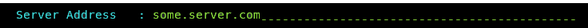
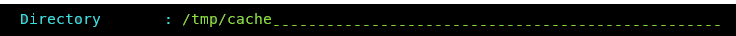
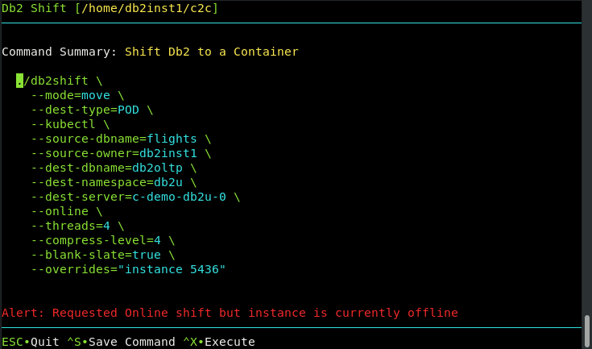
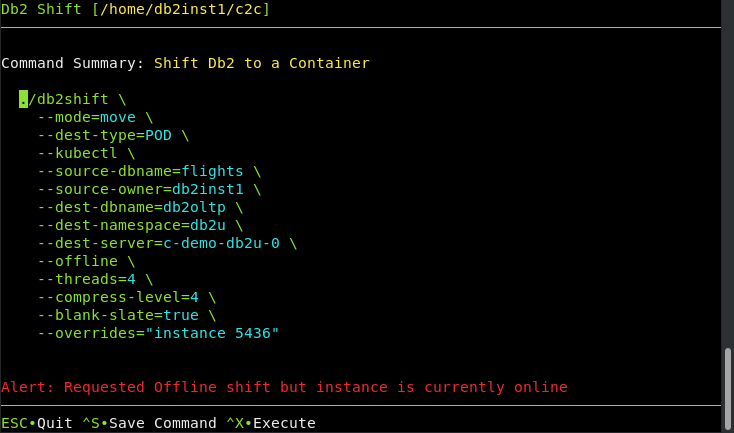

# Options Reference

The following section includes all of the parameters that are used by the Db2 Shift program. Each
section will display the syntax for that option, along with an image of the field in the UI that
you would complete or select.

## Mode Option

Syntax: `--mode=[all,move,clone,apply_clone,sec_and_monitor,hadr_setup]`

The MODE option determines what steps the Db2 Shift program will take to 
move your database to the new location. When using the UI to generate the
scripts, the mode option may not be displayed since it is explicitly
created for you. For instance, when cloning a database, the `--mode=clone`
will have been generated as part of the command.

The following are the values that mode option can have.

### Move Database Only

Syntax: `--mode=move`

The MOVE option will take a copy of your Db2 database and copy it into the
target Db2U container or instance. No other processing is done with the database.

### Move Database and Set up LDAP and DMC Settings

Syntax: `--mode=all`

If you choose the ALL option, the database will be moved and the program
will also apply any security and console settings that are required. This 
is equivalent to running `mode=move` and `mode=sec_and_monitor` one 
after another. The ALL option is necessary in CP4D environments where the
LDAP settings need to be updated and the DMC console needs to be reset to
recognize the new database.

This option is not applicable for Db2 instance to Db2 instance moves.
 
### Clone a Database 

Syntax: `--mode=clone`

The CLONE option can be used to create a copy of database to be moved to
another location and then deployed. This feature is useful in situations
where the target system cannot be reached through the network due to 
firewall issues.

### Apply a Clone to a POD or Instance 

Syntax: `--mode=apply_clone`

The APPLY_CLONE option will take an existing CLONEd database and shift
it to a POD or a Db2 instance. There is no need to be connected to
the original database because all of the control information is 
contained within the CLONEs image.

### HADR Setup Mode

Syntax: `--mode=hadr_setup`, `--mode=hadr_setup`

The HADR option is used to initialize and start HADR between a source and target server. This step
would be run after the database has been shifted to the new location. This option is 
not used for the initial HADR setup of the target system. The target database must be
created with the `--hadr` option in order for it be placed into the correct mode for
HADR communication. The `--hadr` is enabled for pods with the Move Database for HADR
option in the menu.

When moving a database to another instance, the HADR option is on a separate line.

 
### LDAP Security and DMC Setup

Syntax: `--mode=sec_and_monitor`

This setting only applies when the destination is a POD on K8s or
OpenShift. If an associated LDAP repository exists, the db2inst1 user
is added. If the IBM Data management console is deployed with a 
Cloud Pak for Data system, it resets the console and applies the 
relevant DDL and privileges for monitors.

### Copy Mode

Syntax: `--mode=push_clone`, `--mode=pull_clone`

The Db2 Shift will copy a cloned database to a pod, or retrieve the contents of a cloned database back to the local instance.

## Target Client Instance to Instance

Syntax: `--ssh`, `--local`

The client for a deploy (clone) operation must be supplied as part of the Db2 Shift command. 
Only one of the following targets must be used:

* `--ssh` Remote Db2 Instance
* `--local` Local Db2 Instance

If the target is a remote Db2 instance (`--ssh`), Db2 Shift expects that a passwordless
ssh environment has been established between the source and target servers.

The `--local` option only applies to Clones (database copies) that are being deployed
onto the same server that the Db2 Shift command is running on. The ability to
shift a database locally (i.e. make a copy of a Db2 database on the same instance)
is currently disabled due to some restrictions with `db2relocatdb`. 

## Target Client Instance to POD

Syntax: `--oc`, `--kubectl`, `--local`

The pod client for a deploy (clone) operation must be 
supplied as part of the Db2 Shift command. Only one of the following 
clients must be used:

* `--oc` OpenShift Destination
* `--kubectl` Kubernetes Destination
* `--local` Copy of the cloned database is inside the pod

If the client is Kubernetes (`--kubectl`) or OpenShift (`--oc`), 
the program requires that the appropriate `kubectl` or `oc` client 
has been installed locally and that the namespace or project has already been specified.

The `--local` option is used when the cloned copy of the database is already been 
copied inside the POD that it is being shifted to. 

## Source Database

Syntax: `--source-database=""`

The source database is the name of the database that you want to move to
the new location. Note that you can have the same or different database
name at the target. If you provide a different database name at the target,
the program will copy the database from the source and place it on the
target and use the existing name.

## Source or Instance Owner

Syntax: `--source-owner="instance name"`

The Db2 Shift program makes the assumption that the current userid you are logged into
is the owner of the instance. This is necessary due to the requirement
to access the underlying files that are used by Db2. If you supply the 
source owner value, Db2 Shift will double check that you are working in the correct
instance and the settings files are consistent.

## Destination Database

Syntax: `--dest-database=""`

The destination database name can be the same as the source database, or 
a completely different name. Make sure that if you are creating a database
with a different name that it doesn't currently exist on your target system.
Otherwise, the target database will be deleted!

## Force Destination Database Creation

Syntax: `--dest-create-db`

During a shift or clone operation to a traditional Db2 INSTANCE, the Db2 Shift program will
check whether or not the target database exists. If it does not, the Db2 Shift operation will fail. If the
Force Database Creation setting is on, Db2 Shift will attempt to create the database first and then
run the shift operation.

**Note:** Db2 Shift will create the database in a directory structure under `/db2_portable` on the
target system.

## Destination Owner

Syntax: `--dest-owner="instance name"`

The destination owner value is primarily used when settings up HADR between a primary and secondary
instance. However, the value can be supplied so that Db2 Shift can 
check that the correct credentials are available at the target site. 

Note that the `--dest-owner` parameter is only required when doing an HADR setup.

## Destination Server POD

Syntax: `--dest-server="pod_name"`

For deployments to OpenShift, Kubernetes, or CP4D, you must supply the name
of the POD that Db2U is running in. The OpenShift or Kubernetes client should
be used to connect to the target namespace or project before issuing the 
Db2 Shift command. 

## Destination Server Instance

Syntax: `--dest-server=userid@ip.address`

For destinations that are traditional Db2 instances, you must provide the 
userid and the IP address or symbolic name of the destination server. You only use an IP address
for shifting into a traditional Db2 instance.

The format of the parameter is `userid`@`address` when using the Db2 Shift command line. When using the 
UI, this field is generated automatically by combining the destination instance owner name with the
destination server address.

When connecting to a remote instance, the Db2 Shift program 
expects that a passwordless ssh environment has been established between the 
source and target servers. The `--ssh` flag must be used in conjunction with this
parameter.

## HADR Setup

Syntax: `--hadr`

When HADR mode is selected, the database will be copied over to the target location and initialized as an HADR secondary. 
The database can now be
connected with the primary database as an HADR pair and participate in failover or readonly applications. 

This option cannot be used if your database needs to be migrated or if the database needs to be renamed.      

## HADR Source or Destination Server

Syntax: `--source-hadr-server=""`, `--dest-hadr-server=""`

For HADR setup, the Db2 Shift command requires the IP or symbolic
name of the source server that will be used in an HADR setup. This 
server is referred to as the primary server. 

If the destination server is a standard Db2 instance, use the IP address of the server. If the destination 
target is an OpenShift or Kubernetes cluster, use the address of the load balancer.

## HADR ports

Syntax: `--source-hadr-port=#`

HADR communicates over a port which is different than the Db2
instance. You must supply the source and destination port numbers
that Db2 will communicate between the HADR servers. The default
port number is 3700 for HADR communications, but verify the value. The target
port number is only required when HADR is being initialized between two 
traditional Db2 instances. If you are connecting to a POD, this value is not
required because the Db2 Shift program will generate it automatically for you.

## Destination Pod Namespace or Project

Syntax: `--dest-namespace=""`, `--dest-project=""`

In Kubernetes deployments, the location of a pod is associated with 
a namespace, while in OpenShift deployments, the pod is associated with
a project.

When authenticating to a Kubernetes or OpenShift environment, it is 
recommended that the local client be connected to the project or 
namespace that the Db2U pod is running in. 

If you do not supply a namespace or project value, the Db2 Shift program
will assume that you are already connected to that project. If this is not
the case, the program will stop with an error when it attempts to find the 
pod. 

To have Db2 Shift connect to the appropriate project or namespace, 
supply the value of the namespace or project using this option.

## Clone Directory

Syntax: `--clone-dir=""`

The cloned copy of the database will be placed into the directory that is
specified by this field. When the database is cloned, the contents 
of the directory can be moved to a new location and the `--mode=apply_clone`
option used to shift the contents of the clone into the Db2 database.

## Source Clone Directory

Syntax: `--local-dir=""`

The cloned copy of the database will be retrieved or stored in this location 
depending on what type of copy operation is being performance. 

## Target Clone Directory

Syntax: `--dest-dir=""`

The cloned copy of the database will be placed into the target directory that is
specified by this field. If you are pulling a copy (`--mode=pull_clone`), this
field contains the cloned database that is going to move to the local directory.

## Synchronization Options

Syntax:  `--sync=[start_sync, rerun_sync, finish_sync]`

The Db2 Shift program has two methods of moving the database to the
destination. The traditional method is to take one pass at the database
and move everything at once. During the finishing process, the program
will briefly suspend the database (depending on settings) and perform
a final refresh. This last step will pick up any database objects that 
may have changed over the course of the move.

The total amount of time the database is suspended is directly related
to how much information has changed during the shift process. In the 
event that you have large amount of changes, the final refresh may
too long an outage. To minimize this outage, you can use the 
synchronization options provided.

The default setting is do a complete shift operation without intermediate sync operations.

To initialize the synchronization option, the first Db2 Shift
command will use the sync option.

Syntax: `--sync=start_sync`

This initial step will instruct Db2 Shift to copy all of the 
required database objects to the target system. Once the copies are 
complete, the program will end processing and leave the target
system in an incomplete state. During this process the source
database is operational and it will **not be suspended**. 

When there is an appropriate moment, the database movement can 
be finalized with the `finish_sync` option.

Syntax: `--sync=finish_sync`

The `finish_sync` option will do one final pass against the source
database and then it will finalize the database movement on the 
destination site. During the last pass the finish process will
`suspend` the database to get a consistent database environment.
Once this step completes, the destination database will be 
available.

In the event that the source system has high update volumes, there
may be a need to do multiple sync operations to minimize the
finalize step. The Db2 Shift command will need to be told
that it is syncing the database again, but not to start from 
scratch. The control files generated by the `--sync=start_sync` option
will allow Db2 Shift to move database objects that are new
or have changed since the initial synchronization request. The 
command to do the sync and only refresh the database objects
requires the use of the `rerun_sync` option.

Syntax: `--sync=rerun_sync`

The `rerun_sync` option indicates to the Db2 Shift program to
start syncing process to look for delta changes only.

The `--sync=rerun_sync` process can be run repeatedly until
the amount of changes between runs is minimized. When an appropriate
timeslot is available, the shift can be finalized by using the
`finish_sync` option.

Syntax: `--sync=finish_sync`

The `finish_sync` option will perform the final pass against the source
database and complete the shift process as before.

In summary, the standard shift operation will complete in one step (no
`--sync` option is used). The `--sync=start_sync` option allows you 
to gradually move a database over time. For a gradual
database shift, use the `start_sync` option on the first run. This will move
an initial set of database files to the target. Then use the `rerun_sync` option
on subsequent runs to copy any files that may have been added or changed to
the database. When you are ready to finalize the shift, use the `finish_sync`
option to gather any remaining files and complete the shift operation on
the target system.

## Metadata Generation

Syntax: `--blank-slate=[true|false]`, `--gen-settings`, `--verify-only`

The Db2 Shift command generates metadata that is used during the shift process. This metadata is key to determining which
objects need to be moved from a source to destination as well as validating that the source can be successfully moved.

Generating metadata requires access to the source and destination systems. If for some reason the connection to the 
source or destination is unavailable, the existing metadata files can still be used. In most cases you will not need to 
adjust these settings unless you have encountered a shift error.

### Blank Slate

Syntax: `--blank-slate=true`

The `--blank-slate` option determines whether or not the existing metadata is refreshed. The default is value 
for `--blank-slate` is `true` which will display in the GUI as `Refresh`. The `--blank-slate` option will 
delete any existing metadata files and recreate them on your system during the shift operation. The
default option is `true` which will result in new source and destination settings being generated.

If you are importing settings files from other systems, or if you need to rerun the shift process without regenerating the files,
use the `--blank-slate=false` option. When Db2 Shift executes it will use the existing metadata in the working directory and 
attempt to use those settings. 

Syntax: `--blank-slate=false`

One scenario that involves the use of `--blank-slate=false` occurs when a shift operation fails at the target OC/Kubernetes pod
because of a communication error. The database at the destination will be left in an inconsistent state and must be rebuilt
by the shift process. The settings for the destination database can no longer be retrieved because the database cannot be 
started. Because of this reason, you must use the existing destination settings that were generated when you first ran the
Db2 Shift command.

### Generate Settings

Syntax: `--blank-slate=true`, `--gen-settings`

The `--gen-settings` (Generate Settings) option is used in conjunction with `--blank-slate`. The use of `--gen-settings` 
will prevent Db2 Shift from continuing execution after the metadata files have been created. 

### Verification

Syntax: `--verify-only`

The `--verify-only` option will generate the metadata files and check the connectivity and all settings and then stop
execution. If `--verify-only` completes successfully, the Db2 Shift command will be able to execute the shift process.

## Online or Offline Move

Syntax: `--online`, `--offline`

Db2 Shift provides two options when dealing with the state
of a database during the shift process:

* `--online` - database is online while the shift is taking place
* `--offline` - database has been shut down

By default, the Db2 Shift command assumes you will use
online mode and will suspend the database while it completes
the last scan of the files. During this period, the database
will not complete any insert, update, or delete
transactions. This will result in a consistent database at
the destination, but some transactions will not have been
committed to the database. If the database at the
destination must be identical to the source database, then
you must completely shut down the database and choose the
`--offline` option.

During the last step of the shift process, Db2 Shift will
search for any updates that may have been applied to the
database after the initial copying was done. To ensure the
integrity of the data being copied, the database will be
placed into a `WRITE SUSPEND` mode. This last step should only
take a few seconds and the database will be `WRITE RESUMED`
when the final copy is done.

When the database is suspended, all read activities will
continue. New connections will not be permitted, but any
applications that are currently running will be allowed to
continue. Those transactions that are updating records will
be temporarily "paused" while the copying is done. Once the
copy is complete, a suspended application will finish their
transaction.

The period that the database is suspended or stopped is
dependent on the changes that have occurred in the database
from the time the shift operation started to the time when
copying of the data is complete. The changes that have
occurred during this period needs to be captured during the
final step. It is during this step that the database must be
suspended or stopped. During the initial scan the database
will remain completely online and will not be impacted by
the shift utility from a transaction perspective. However,
since there is a large amount of disk reads taking place, it
may impact buffer pool read performance.

The offline mode must be used when shifting a database that
requires a migration from an older release of Db2. This
option must be specified when shifting Db2 versions 10.5 or
11.1.

To use offline mode, you must run Db2 Shift against the
source and target using:

* Shift command with `--verify-only`

This step will generate a copy of the control files needed:

* Db2 Shift operation using the offline mode `--offline`

If you do not create the control files beforehand, the Db2
Shift operation will not have the necessary control files to
run the shift.

### Online or Offline Mode Mismatch

Online and Offline checking is performed when you use any of the following Shift  modes:

* Shift to Pod
* Shift to Instance
* Clone

If you have specified online mode for a shift, and the database is currently
offline, the command summary will display an alert message.

Similarly, if you need to run the shift in offline mode, but the database is currently
online, an alert will be displayed.

These alerts do not prevent you from running the command. You have the opportunity to
save the command for later use, or change the status of the Db2 instance in another
command window. If you do not change the status of the database to match the
command value, the Db2 Shift command may fail during execution. 

## Threading

Syntax: `--threads=[1..8]`

The copy phase of the Db2 Shift program is able to use multiple threads to transmit data to a destination. 
This settings allows you to increase
the parallelism up to 8 threads. As you increase the number of threads, the amount of data being transmitted
increases, at the expense of greater CPU usage and network congestion. The default value is 4 which strikes a balance between
overhead and network performance.

## Compression

Syntax: `--compression=[0..9]`

RSYNC compresses the data during the transfer process to allow for faster
movement of data. The amount of compression can be adjusted from 0 to 9
with 0 turning off compression and values between 1 and 9 increasing the
amount of compression applied to the data. Higher compression values will
result in more CPU usage and may not significantly reduce the size of the
datastream. 

A value of 4 has been found to be a good compromise between
compression overhead and data size on slow networks (<1Gb/s). 
For high-speed networks, a value of 0 is recommended
unless there is a requirement to reduce network traffic. 

## Stored Procedures and Functions

Syntax: `--exclude-functions`

By default, the Db2 Shift command will automatically move all external stored procedures and functions 
that are found in the `$HOME/sqllib/function` path to the new destination. All SQLPL and PL/SQL routines 
are moved as part of the database move, so there is no migration required for those routines. 

Use the exclude flag to prevent any external functions being moved to the destination.

## Overrides

Syntax: `--overrides=""`

The overrides field is used to update INSTANCE settings at the target location. All database settings
are moved during the shift process, but no INSTANCE settings are changed. 

If you need to change any INSTANCE settings, place the name of the parameter, following by the value on this line.
Multiple parameters can be placed on the line by separating each parameter/value pair with a semi-colon `;`.