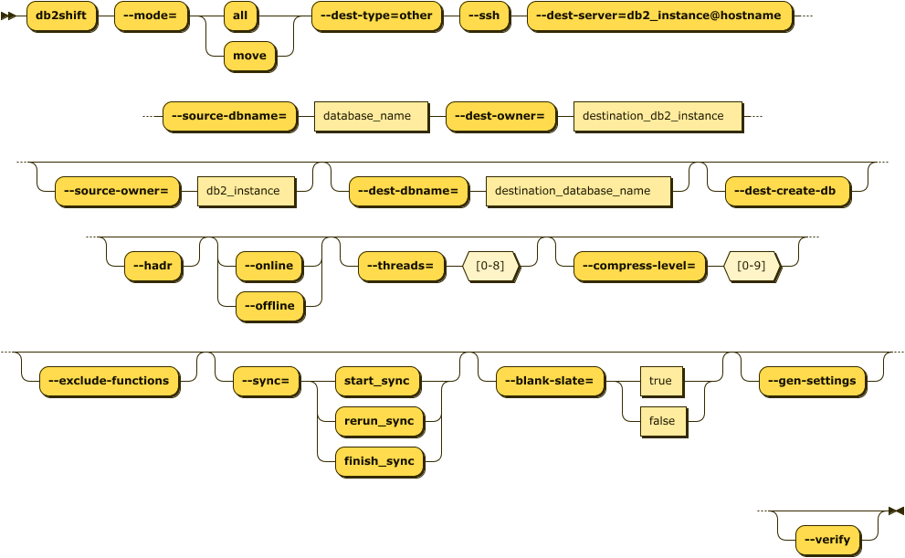
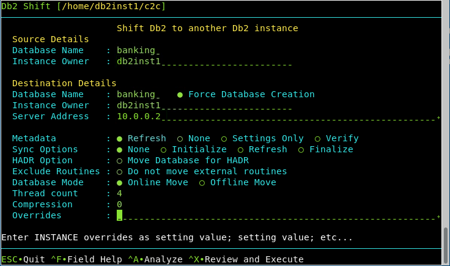

# Db2 Containerization to another Db2 Instance

This format of the Db2 Shift will take an existing Db2 database on an on-premise system,
and shift it to another traditional Db2 system hosted on another on-premise
server or cloud virtual machine. This does not containerize Db2! The Db2 Shift command 
requires the following information:

* Source Database details
* Destination location
* Shift Options

The db2shift program assumes that you are currently connected to the instance
that has the Db2 database and have ssh connectivity to the target server.

The syntax for running a direct shift from a Db2 database to a POD is:

<pre><code class="language-bash">db2shift

    Required Options

    --mode=move    
    --ssh
    --dest-type=OTHER
    --source-dbname=flights
    --source-owner=db2inst1
    --dest-dbname=db2oltp
    --dest-server=db2inst1@some.server.com \ 

    Optional Settings
    
    --hadr
    --dest-create-db
    --online or --offline
    --threads=4
    --compress-level=0
    --exclude-functions
    --sync=[start_sync, rerun_sync, finish_sync]
    --blank-slate=[true|false] --gen-settings
    --verify
</code></pre>

The panel that provides this capability:

 
## Mode Option (Command Line Only)

Syntax: `--mode=move`

The MODE option determines what steps the Db2 Shift program will take to 
move your database to the new location. The only valid option is
`move` when shifting a database between two Db2 instances.
 
## Target Client (Command Line Only)

Syntax: `--ssh`

The client for a deploy (clone) operation must be supplied as part of the Db2 Shift command. 
If the target is a remote Db2 instance (`--ssh`), Db2 Shift expects that a passwordless
ssh environment has been established between the source and target servers.

## Destination Type (Command Line Only)

Syntax `--dest-type=OTHER`

The destination is another instance (OTHER). This setting is
only required when using the command line. It is
automatically generated by the UI. 

## Settings (Command Line and UI)

* [Database Name (Source)](reference.md#source-database)
* [Instance Owner](reference.md#source-or-instance-owner)
* [Database Name (Destination)](reference.md#destination-database)
* [Force Database Creation](reference.md#force-destination-database-creation)
* [Destination Owner](reference.md#destination-owner)
* [Server Address](reference.md#destination-server-instance)
* [Metadata](reference.md#metadata-generation)
* [Synchronization Options](reference.md#synchronization-options)
* [HADR Option](reference.md#hadr-setup)
* [Exclude Routines](reference.md#stored-procedures-and-functions)
* [Database Mode](reference.md#online-or-offline-move)
* [Thread Count](reference.md#threading)
* [Compression](reference.md#compression)
* [Overrides](reference.md#overrides)