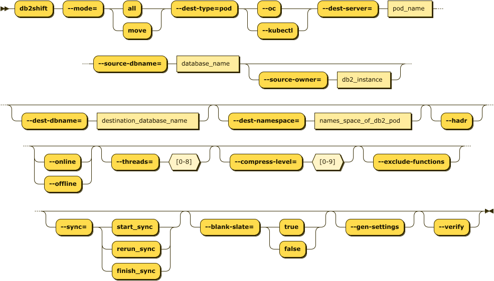

# Db2 Containerization to OpenShift, Kubernetes, or CP4D

Containerizing an existing Db2 database on an on-premise system to OpenShift, Kubernetes, or CP4D 
is the most common scenario for using Db2 Shift. In order to move a Db2 database to a POD you 
will require the following information:

* Source Database details
* Destination location
* Type of Containerization environment
* Shift Options

The target of the Db2 Shift operation can be OpenShift, a Kubernetes cluster, or Cloud Pak for Data system. 

The syntax for running a direct shift from a Db2 database to a POD is:

<pre><code class="language-bash">db2shift

    Required Options

    --mode=[move | all]    
    --dest-type=POD
    --oc or --kubectl
    --source-dbname=flights
    --source-owner=db2inst1
    --dest-dbname=db2oltp
    --dest-server=c-demo-db2u-0
 
    Optional Settings

    --dest-namespace=db2u
    --hadr
    --online or --offline
    --threads=4
    --compress-level=0
    --exclude-functions
    --sync=[start_sync, rerun_sync, finish_sync]
    --blank-slate=[true|false] --gen-settings
    --verify
</code></pre>

The panel that provides this capability:

## Mode Option (Command Line and UI)

The MODE option determines what steps the Db2 Shift program will take to 
move your database to the new location. The following are the values that
move can have.

### Move Database Only

Syntax: `--mode=move`

The MOVE option will take a copy of your Db2 database and copy it into the
target Db2U container or instance. No other processing is done with the database.

### Move Database and Set up LDAP and DMC Settings (CP4D)

Syntax: `--mode=all`

If you choose the ALL option, the database will be moved and the program
will also apply any security and console settings that are required. This 
is equivalent to running `mode=move` and `mode=sec_and_monitor` one 
after another. The ALL option is necessary in CP4D environments where the
LDAP settings need to be updated and the DMC console needs to be reset to
recognize the new database.

### Move Database for HADR Setup

Syntax: `--mode=move --hadr`

When HADR mode is selected, the database will be copied over
to the target location and initialized as an HADR secondary.
The database can now be connected with the primary database
as an HADR pair and participate in failover or readonly
applications. 

This option cannot be used if your database needs to be migrated or if the database needs to be renamed.

## Destination Type (Command Line Only)

Syntax `--dest-type=POD`

The destination is a POD. This setting is only required when using the command line. It
is automatically generated by the UI. 

## Settings (Command Line and UI)

* [Database Name (Source)](reference.md#source-database)
* [Instance Owner](reference.md#source-or-instance-owner)
* [Target Location (Pod)](reference.md#target-client-instance-to-pod)
* [Database Name (Destination)](reference.md#destination-database)
* [POD Project](reference.md#destination-pod-namespace-or-project)
* [POD Name](reference.md#destination-server-pod)
* [Metadata](reference.md#metadata-generation)
* [Synchronization Options](reference.md#synchronization-options)
* [Exclude Routines](reference.md#stored-procedures-and-functions)
* [Database Mode](reference.md#online-or-offline-move)
* [Thread Count](reference.md#threading)
* [Compression](reference.md#compression)
* [Overrides](reference.md#overrides)